<div align="center">

# TrueReplayer — User Guide

[Português (BR)](GUIDE.md) · **English** &nbsp;·&nbsp; [← Back to README](../README.en.md)

</div>

The complete reference for everything TrueReplayer can do. New here? Start with the [Quick start](../README.en.md#quick-start) in the README, then come back for the details.

## Contents

- [Core concepts](#core-concepts)
- [Recipes — learn by doing](#recipes--learn-by-doing)
- [Recording](#recording)
- [Replaying & execution settings](#replaying--execution-settings)
- [The action grid](#the-action-grid)
- [Action reference](#action-reference)
- [Conditional blocks (If / Else / EndIf)](#conditional-blocks-if--else--endif)
- [Assert — require something to be true](#assert--require-something-to-be-true)
- [Profiles & folders](#profiles--folders)
- [Hotkeys & hotstrings](#hotkeys--hotstrings)
- [Automation (fire without a hotkey)](#automation-fire-without-a-hotkey)
- [Key remaps](#key-remaps)
- [Window targeting & relative coordinates](#window-targeting--relative-coordinates)
- [Multi-window automation (Activate Window)](#multi-window-automation-activate-window)
- [Clicker mode (auto-clicker)](#clicker-mode-auto-clicker)
- [Game mode](#game-mode)
- [Send Text](#send-text)
- [Variables, slots & prompts](#variables-slots--prompts)
- [Data Loop](#data-loop)
- [Browser automation](#browser-automation)
- [Themes & appearance](#themes--appearance)
- [Settings reference](#settings-reference)
- [Where your data lives](#where-your-data-lives)
- [Troubleshooting](#troubleshooting)

---

## Core concepts

- **Profile** — a single macro: an ordered list of actions plus its own settings (delays, loops, window target, etc.). Saved as a `.json` file.
- **Action** — one step in a profile (a click, a keystroke, a pause, an *If*, …). Shown as a row in the grid.
- **Folder** — an organizational, colored group of profiles. A profile lives in at most one folder.
- **Macro mode vs Clicker mode** — *Macro mode* records and replays action lists; *Clicker mode* is a dedicated auto-clicker. Switch with **`ScrollLock`** or the Macro/Clicker toggle at the bottom.

---

## Recipes — learn by doing

Fourteen short, complete tasks, easiest first. Each one names the exact buttons you click, and each is a real job somebody automates every day. Do two or three and you'll know the app.

Most useful macros are **tiny** — one or two actions. Don't feel you have to record something long.

### 1. A canned reply you can type anywhere

**You get:** typing `.cp` in any chat box expands into a full answer and sends it.

1. Toolbar → **Send Text**. Write the message.
2. From the token palette on the right, click **Enter** to put `{enter}` at the very end — that's what sends the message.
3. **`Ctrl+Enter`** to confirm, then **Save** the profile.
4. Right-click the profile → **Assign hotstring…** → type `.cp` → **Assign**.

*In practice:* a support desk keeps one of these per answer — `.cp` for the discount code, `/ve` for "it's on its way", `/pg` for the payment link. One action each.

### 2. Put whatever you copied inside the reply

**You get:** you copy the customer's username, press one key, and a full set of instructions goes out with that name already in it.

1. In **Send Text**, write your text and put `{clipboard}` where the copied value belongs.
2. Need only part of it? Add modifiers: `{clipboard:trim}` (drop stray spaces and line breaks), `{clipboard:line:3}` (just the third line), `{clipboard:upper}`.

Your own clipboard is restored right after, so nothing is lost.

*In practice:* copy a multi-line account block and re-emit only the lines you need with `{clipboard:line:1}` and `{clipboard:line:3}`.

### 3. Stamp the time and close the ticket

**You get:** one key posts the "delivered" message with today's date, then fires your helpdesk's own *resolve* shortcut.

1. **Send Text** → your message, then `Finished at {datetime}`, then `{enter}`.
2. Toolbar → **Send Keystroke** → press `Ctrl+Alt+R` (whatever your app uses) → **Add**.
3. Right-click the profile → **Assign hotkey…** → press `F1` → **Assign**.

Two actions, and the whole close-out is a single keypress.

### 4. Ask me for a value when it runs

**You get:** the macro stops, asks you a question, and types your answer into the right place.

1. In **Send Text**, type `{input:Order number}` where the answer should land.
2. Want a pick-list instead of a text box? Use `{input:Priority|menu:Low,Medium,High}`.

You're asked **once per run** — reuse the same `{input:Order number}` later and it types the same answer without asking again.

### 5. Make it work only in one app

**You get:** the macro's hotkey fires only when the right window is in front, and the clicks follow that window when it moves.

1. Right-click the profile → **Window target…**.
2. Click **Detect Window (click on target)**, then click the real window — the process and title fill themselves in.
3. Click **Test front window** to confirm it says *Matches*.
4. Turn on **Relative Coordinates** so clicks are stored relative to the window's corner.
5. If the macro was already recorded, accept the **Convert to Relative** prompt.

> Without this, a window moved by 20 px makes every click land in the wrong place.

### 6. Wait for the screen instead of guessing

**You get:** the macro waits for the button to actually appear, instead of clicking a spot that isn't ready yet.

1. Toolbar → **Wait for Image / Pixel** → **Wait for Image**.
2. The screen freezes — drag a rectangle around the button (or icon) you're waiting for.
3. In the panel that opens, click **Test match** to check it against the live screen. Aim for a comfortable match; leave confidence near **85%**.

> **Never set confidence to 100%.** A live screen never reproduces a reference pixel-for-pixel, so a 100% match simply times out.

*In practice:* this is the fix for "it works when the internet is fast and breaks when it's slow".

### 7. Do the optional click only when it appears

**You get:** a confirmation dialog gets clicked *if* it shows up, and the macro carries on normally when it doesn't.

1. Toolbar → **Conditional** → **Pixel Color Match**.
2. Pick a point inside the confirm button's solid color.
3. Select the **If** row and set **Wait for condition** to `5000` — it now waits up to 5 seconds for that color before deciding.
4. Put the click *between* **If** and **EndIf**.

Color beats an image when two states differ only by color — a green enabled button vs a grey disabled one.

### 8. Remember a value between steps

**You get:** compute or capture something once, reuse it anywhere later in the run.

1. Toolbar → **Set Variable**. Give it a **Name** (e.g. `customer`) and a **Value** — the value can itself contain tokens, like `{clipboard:trim}`.
2. Anywhere later, type `{var:customer}`.

Variables are cleared at the start of every run. Set the mode to **Cycle** and the value becomes a list — each run takes the *next* line, wrapping at the end.

### 9. Collect several values, paste them all later

**You get:** grab three things from three different places, then fill a form with all of them.

1. Settings → **Keys** → **Hotkeys** → **Capture Slot**. It ships as `Win+Ctrl+C` — change it if you'd rather use something else.
2. Select some text anywhere and press that combo. Repeat — captures land in slots 1, 2, 3… up to 9, then wrap.
3. In a profile, type `{clip:1}`, `{clip:2}`, `{clip:3}` wherever they belong.

Slots survive between runs, unlike variables. To capture *during* a macro instead of by hand, use the **Copy to Slot** action with a named slot and read it back with `{clip:name}`.

### 10. Type the next item from a list on every press

**You get:** one hotkey that works through a checklist — a different item each time you press it.

1. Toolbar → **Data Loop** → **Paste / bulk edit…** → paste your list from Excel → **Replace table**.
2. Leave **Loop over data** **off**.
3. In **Send Text**, type `{row:col1}` (or your column's name) and `{enter}`.

Each press uses the next row and advances; at the end it wraps back to the top and chimes. Right-click a row → **Reset row position** to start over. Where the list stopped is **saved to disk** — close the app halfway through and carry on tomorrow.

*Shortcut for a list that changes constantly:* skip the table. Copy the list (`Ctrl+C`, from anywhere) and type `{clipboard:next}` in the **Send Text** — each press pastes the next line of what you copied, and copying something else restarts it by itself. See [Send Text](#send-text).

### 11. Replace 20 repeated steps with one loop

**You get:** one small macro plus a table, instead of the same five actions copy-pasted seventeen times.

1. Build the macro **once**, for a single item.
2. Toolbar → **Data Loop** → paste a table with a column per changing value (e.g. `item` and `qty`).
3. Replace the fixed values in your actions with `{row:item}` and `{row:qty}`.
4. Turn **Loop over data** **on** — the macro now runs once per row.
5. Set **On row error** to **Skip row** if one bad row shouldn't stop the batch.

*In practice:* an 87-action macro that loads 17 items into a form becomes 5 actions and a 17-row table — and adding an item is a new row, not a re-recording.

### 12. Reuse one ending in many macros

**You get:** twenty macros that all finish with the same confirmation steps — fixed in one place.

1. Put the shared steps in their own profile (e.g. `Confirm`).
2. In each macro, toolbar → **Run Profile** → pick `Confirm` → **Add**.

Fix the confirm flow once and all twenty improve. Chains deeper than 5 levels are blocked automatically.

> The sub-profile's own **Loops** are ignored — only the **Repeat** count in the dialog applies.

### 13. Click a website by name, not by position

**You get:** web steps that survive the page moving around.

1. Install the Chrome extension (see [Browser automation](#browser-automation)) and make sure it's connected.
2. Toolbar → **Browser** → **Browser Click**, and pick the element on the page.
3. Prefer matching by visible **text** (e.g. `text=Send`) when the layout changes often.

*In practice:* three selector clicks move a helpdesk conversation to another inbox — no coordinates at all, so it keeps working when the window is resized.

### 14. Run it without pressing anything

**You get:** the macro fires on its own — every N minutes, at a set time, or when something appears on screen.

1. Settings → **App** → **Automation** → **Manage ›**.
2. **+ Add automation** → pick the profile.
3. Choose the **Trigger**: **Interval**, **Schedule** or **Condition**.
4. **Save**, then flip the row's **Armed** toggle in the list.

> Saving is not arming. A configured automation does nothing until you arm it — that toggle is the one people miss.

Turn on **Run on Startup** + **Startup Minimized** (Settings → App → Startup) and TrueReplayer becomes a background helper in the tray.

---

## Recording

1. Make sure a profile is active (or start a new one).
2. Press **`Ctrl+PageUp`** (or click **Recording**). The Recording badge and button start glowing so you can't miss that capture is live.
3. Do your actions — clicks, typing, scrolling.
4. Press **`Ctrl+PageUp`** again to stop.

**Where new steps land:** if you have rows **selected**, recording inserts **before** the first selected row; with **no selection**, it **appends** to the end. Clear the selection to append.

### Capture filters (Settings → Profile → Recording)

| Toggle | Effect |
| --- | --- |
| **Mouse Clicks** | Capture left / right / middle clicks and double-clicks. |
| **Mouse Scroll** | Capture scroll-wheel up/down. |
| **Keyboard** | Capture key presses and modifiers. |
| **Combined Actions** | **On** → input is merged into single rows (e.g. `Ctrl+C` = one *Keystroke* row). **Off** → recorded as separate `KeyDown`/`KeyUp` (and `LeftClickDown`/`LeftClickUp`) rows — needed for drags or holding a key while doing other things. |

All four default to **On**.

---

## Replaying & execution settings

Press **`Ctrl+PageDown`** (or click **Replay**) to run the active profile; press again or click **Stop** to halt immediately (any held buttons are released). During replay the **"Replaying"** badge and **Stop** button pulse so the running state is obvious, and the status bar shows progress, elapsed time and the loop counter.

**Execution** settings (Settings → Profile tab) control timing:

| Setting | What it does | Default |
| --- | --- | --- |
| **Delay** | A fixed delay (ms) applied before each action, overriding recorded timing. | 100 ms (on) |
| **Loops** | How many times to repeat the whole macro. **0 = forever.** | 1 |
| **Interval** | Pause (ms) between loop iterations. | off |
| **Jitter** | Random ± % applied to each delay, so playback isn't perfectly regular. | off |

---

## The action grid

The central table lists every action in the profile. Columns: **selection checkbox · Action (colored pill) · Details · Delay · Notes**.

<!-- PICT: main.png — The whole main window: profiles & folders panel on the left, the action grid in the center (with a few sample actions and the toolbar visible at the top), the Settings panel on the right. It's the opening shot; make it a sample profile with a variety of actions. -->
<p align="center">
  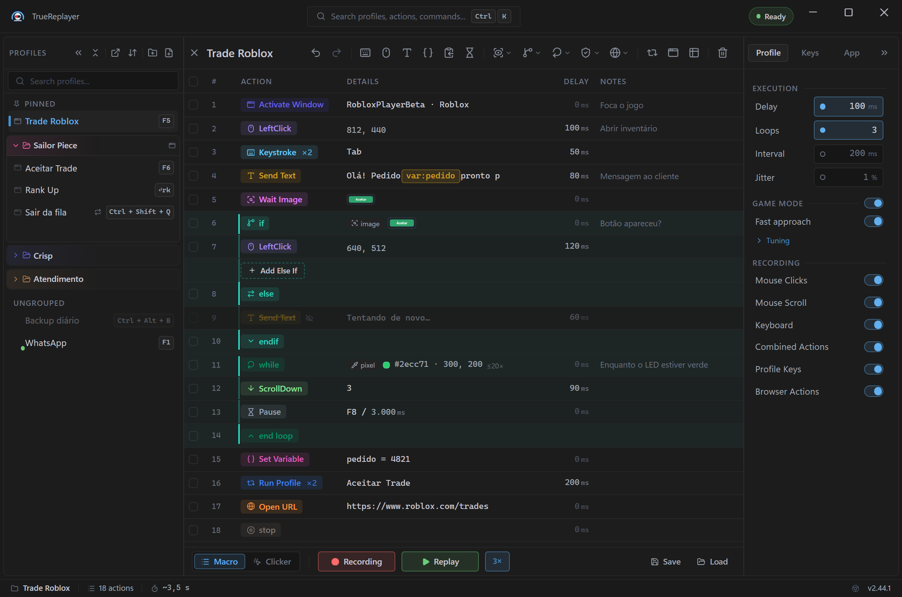<br>
  <sub><i>Profiles &amp; folders on the left, the action grid in the center, settings on the right.</i></sub>
</p>

- **Select** — click a row (single), `Ctrl+Click` (toggle), `Shift+Click` (range), or use the checkboxes.
- **Edit inline** — click a cell to edit **Delay**, **Notes**, **coordinates** (`x, y` for mouse rows — separators can be comma/semicolon/space) or the **Key** (keyboard rows capture the next key you press). Commit with **Enter/Tab**, cancel with **Esc**.
- **Reorder** — drag a row, or select and press **`Alt+↑` / `Alt+↓`**.
- **Right-click** a row for **Duplicate**, **Delete**, **Edit** and more. (**Else** isn't here — it goes in via the dashed **+ Add Else branch** row inside the If block.)
- **Skip** — unchecking a row keeps it in the list but it won't run during replay.
- **Bulk bar** — when multiple rows are selected, a bar appears with **Set delay**, **Set X / Set Y** (a `+10` / `-5` offset adjusts each; a plain number sets all), **Set notes**, **Move ↑/↓**, **Skip**, **Delete**.
- **Sheet panel** — right-click → Edit (or open the Sheet) for a full form with every field of the selected row.

> **Note:** *Else / EndIf* are pure jump markers — their Delay cell is blank and not editable, and a bulk "set delay" skips them. The opening **If** *does* take a delay: it's a **pre-probe wait** applied before the condition is checked, so a slow-to-appear image/pixel isn't read as "false" and the block wrongly skipped.

---

## Action reference

| Action | What it does |
| --- | --- |
| **Left / Right / Middle Click** | A click of that button at `(x, y)` — or **N clicks** with a configurable gap and optional **Gap jitter** and **Position jitter** (see below). |
| **Double Click** | Two left clicks at the same point, timed below the system double-click threshold so apps treat it as a real double-click. Also takes **× N** (see below). |
| **Keystroke** | Press a key or combo once — or **N times** with a configurable gap and an optional **Gap jitter** (see below). |
| **Hold Key** | Hold a single key down for a set duration (default 1000 ms). Modifiers are dropped. |
| **Key Down / Key Up** | A standalone press or release — for holds and drags where down/up must be separate. |
| **Scroll Up / Down** | One mouse-wheel notch at the cursor. |
| **Send Text** | Inject text (with tokens, snippets, clipboard transforms) — see [Send Text](#send-text). |
| **Set Variable** | Store a named value for the rest of the run, read back with `{var:name}`. In *Cycle* mode the value is a list and each run takes the next line — see [Variables, slots & prompts](#variables-slots--prompts). |
| **Copy to Slot** | Copy whatever is **currently selected** in the focused app into a named clipboard slot, read back with `{clip:name}`. |
| **Pause** | Halt until a **resume hotkey** is pressed or a **timeout** expires (whichever comes first). Needs at least one of the two. |
| **Wait Image** | Block until a reference image appears on screen (optionally within a cropped search region; confidence default ≈ 85%). |
| **Wait Pixel Color** | Block until the pixel at `(x, y)` matches a target hex color (within tolerance). |
| **Run Profile** | Run another profile as a sub-step — optionally a set number of times. Cycles and chains deeper than 5 levels are blocked automatically. |
| **Activate Window** | Act on another app's window mid-run: **Activate** (bring to the front — launching it first if needed), **Maximize**, **Minimize** or **Close**. *Activate* changes the OS focus target only, never the coordinate context. See [Multi-window automation](#multi-window-automation-activate-window). |
| **If / Else / EndIf** | Conditional branch — see [Conditional blocks](#conditional-blocks-if--else--endif). |
| **Assert** | A single row that **requires** something to be true and **stops the run naming the failure** when it isn't. No branch, no `EndIf` — see [Assert](#assert--require-something-to-be-true). |
| **Browser actions** | Click / Right Click / Type / Navigate / Wait element / Assert element / Select option in Chrome — see [Browser automation](#browser-automation). |

Insert actions from the **toolbar** (Send Keystroke, Send Text, Set Variable, Copy to Slot, Pause, Wait, Conditional, Browser, Run Profile, Activate Window, Data Loop). Most actions open a small dialog to configure them; click an action's Details cell later to edit it.

### Send Keystroke — Press × N and Gap jitter

The **Send Keystroke** dialog has a **Press / Hold** selector. In **Press** mode you capture a key or combo and get three fields (the last two are only active when **Times to repeat** > 1):

- **Times to repeat** — how many times to press (1 to 999; default 1).
- **Gap between presses** — the interval between one press and the next (default 30 ms; 0 to 5000).
- **Gap jitter** — **off by default**. Turn it on with the dot to the right of the label and it adds a random **± %** to *each* gap, drawn fresh every cycle, so the burst doesn't run at a perfectly fixed rhythm — a constant gap is the easiest way to look like a bot. Turned on, it starts at 20% (1 to 100).

In **Hold** mode you set a **Hold duration** (default 1000 ms) with shortcut chips (100 ms · 500 ms · 1 s · 5 s · 30 s); modifiers are dropped.

> This **Gap jitter** is local to *one* Keystroke action. Don't confuse it with the Execution **Jitter** (Settings → Profile), which is a global ± % applied to *all* replay delays.

> **Key capture only listens while TrueReplayer is in front.** That covers the **Send Keystroke** pad and the **Pause** resume hotkey: if you click into another window with the capture box open — to check a shortcut in the app you're automating, say — what you type over there is **not** captured. Come back to TrueReplayer and press the combo. It used to record any keystroke system-wide, so a capture box left open would pick up whatever you were doing elsewhere.

<!-- PICT: send-keystroke.png — The "Send Keystroke" dialog in Press mode with the three fields filled in: "Times to repeat" = 5, "Gap between presses" = 30 ms, and "Gap jitter" ON (the accent dot filled in to the right of the label) with the % field active (e.g. 20%). A key captured in the pad above (e.g. F5 or Tab) so the Add/Save button is active. -->
<p align="center">
  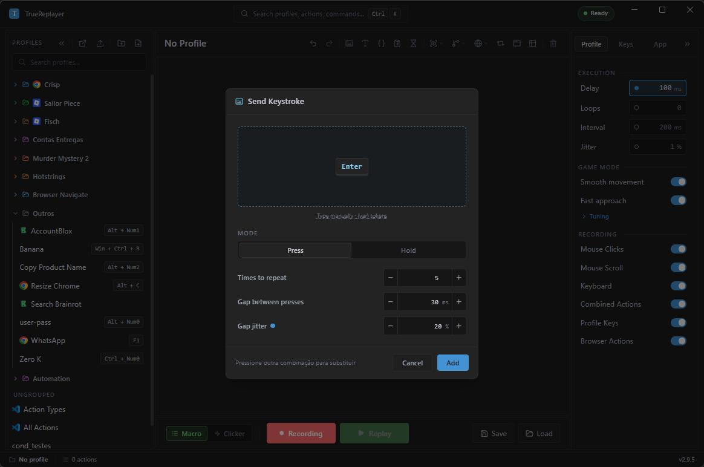<br>
  <sub><i>Press × N with <b>Gap jitter</b> on — the burst loses its fixed rhythm.</i></sub>
</p>

### Mouse Click × N — Times, Gap, Gap jitter and Position jitter

The same "× N" Send Keystroke has exists for mouse clicks — except it lives in the row's **Sheet panel**, not in a dialog. Right-click the click row → **Edit** (or open the Sheet) and look for the **Repeat** block. It applies to **Left Click**, **Right Click**, **Middle Click** and **Double Click**; separate *ClickDown* / *ClickUp* rows don't get it (they're halves of a click, not a whole one).

- **Times to repeat** — how many clicks (1 to 999; default 1). At **1** the row behaves exactly as it always did.
- **Gap between clicks** — the interval between one click and the next (0 to 5000 ms). The default is **30 ms** for a single click and **600 ms** for **Double Click** — a double-click needs a gap above the Windows double-click speed (≈ ½ s) so each repeat registers as a *distinct* double-click instead of blurring into one long burst.
- **Gap jitter** — **off by default**. Turn it on with the dot to the right of the label: it adds a random **± %** to *each* gap, drawn fresh every cycle. Turned on, it starts at 20% (1 to 100).
- **Position jitter** — **off by default**, its dot sits right below Gap jitter. On, it scatters the **click point** by **± N pixels** on each axis, drawn fresh every repeat. Turned on, it starts at 3 px (1 to 500).

The last three fields only become active when **Times to repeat** > 1 — they describe a burst, and a burst of one has no gap and no scatter.

> **When to turn Position jitter on.** A `Click × 3` with **Gap jitter + Position jitter** clicks the same region varying a few ms *and* a few pixels — that's what makes a burst look human in games, where hitting the same pixel on the same beat is the most obvious macro tell. For ordinary desktop automation (a button, a field, a spreadsheet cell), **leave it off**: there you want the exact pixel you picked.
>
> In a **Double Click × N** the offset is drawn once per repeat and applies to the whole double-click — the two clicks of a pair never separate, or Windows would stop reading them as a double-click at all.

<!-- PICT: click-repeat.png — The Sheet panel open on a Left Click row, showing the full "REPEAT" block: "Times to repeat" = 3, "Gap between clicks" = 200 ms, "Gap jitter" ON (accent dot filled) at 20%, and "Position jitter" ON at 12 px. Frame from the REPEAT label down to the Delay field so all four rows are visible together. -->
<p align="center">
  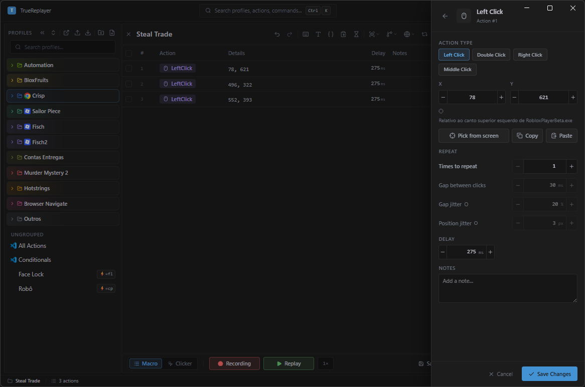<br>
  <sub><i>Click × 3 with <b>Gap jitter</b> and <b>Position jitter</b> on — both dots lit. Off, the row clicks the same pixel at the same rhythm.</i></sub>
</p>

> **Tip — match by colour, not confidence.** Image matching compares the whole reference, so it's great for shape/text but a blunt tool for telling apart two states that differ only in **colour** (e.g. an enabled *green* vs a disabled *grey* button). For that, use **Wait Pixel Color** (or an **If** on *Pixel Color Match*): sample a point in the solid fill and match the colour within a tolerance. Also don't set **confidence to 100%** — a live screen never reproduces a reference pixel-for-pixel, so a 100% match times out (it's capped just under 100% internally).

---

## Conditional blocks (If / Else / EndIf)

Make a macro react to what's on screen.

<!-- PICT: conditionals.png — (You can REUSE the current one — the conditionals grid hasn't changed since 2026-07-19.) Two nested If/Else/EndIf blocks in the grid, showing the per-scope-level colors. -->
<p align="center">
  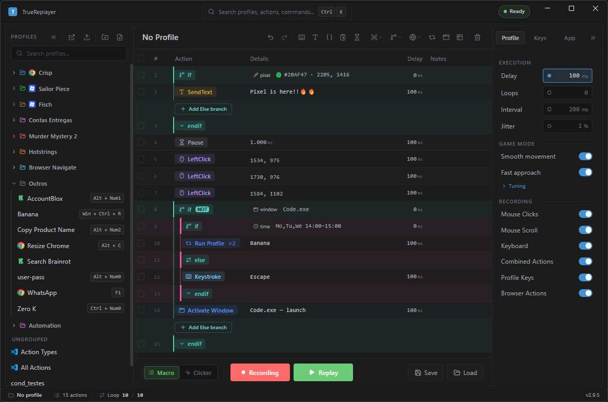<br>
  <sub><i>A negated pixel check (<code>if NOT</code>) and an image check with an <code>else</code> branch.</i></sub>
</p>

- An **If** runs a **probe** — a quick yes/no check. Pick the type from the toolbar's **Conditional** menu when you insert the block:

| Condition | True when |
| --- | --- |
| **Image Found** | A reference image is visible on screen. |
| **Pixel Color Match** | The pixel at `(x, y)` matches a color (within tolerance). |
| **Window Open** | A window matching a process/title exists — optionally only when it's in the foreground. |
| **Clipboard** | The clipboard text matches (Contains / Equals / Regex). |
| **Browser Element** | An element in Chrome is present, visible or enabled. |
| **Random** | A dice roll lands under N% — for macros that shouldn't look perfectly regular. |
| **Variable** | A `{var:name}` compares true against a value (equals, contains, greater than, …). |
| **Process Running** | A named process is alive. |
| **File Exists** | A file or folder exists on disk. |
| **Time** | The clock is inside a start–end window, on the weekdays you pick. |

- If the probe is **true**, the actions between **If** and **Else/EndIf** run; if **false**, execution jumps to the **Else** branch (if present) or past the **EndIf**.
- **Negate (IFNOT)** flips the test — the *true* branch runs when the probe **fails**.
- **Wait for condition (optional)** — by default an **If** checks once and branches instantly. Set a *Wait for condition* value (ms) and it polls that long for the condition to become true before deciding: satisfied in time → **true** branch; time runs out → **Else / false**. Great for *"wait up to 3 s for the button to enable, else take a fallback path."* `0` = instant (the default).
- **On Probe Error** — what to do if the *check itself* errors (e.g. a screen capture fails). **Treat as false** (default) counts as "not found" and takes the false/Else branch; **Halt** stops the replay. Leave it on *Treat as false* for a forgiving macro.
- Blocks can be **nested** — each nesting level shows in its own colour (with matching scope rails) so deep conditionals stay readable. To create a nested block, select a row **inside** an existing block, then **Insert Conditional**. Add an **Else** via the dashed **+ Add Else branch** row inside the block. The structure is validated and auto-repaired on load (orphan markers removed, missing `EndIf` added).

**Editing a block's contents** — actions *inside* a block edit granularly; an operation only snaps to the **whole block** when your selection includes a marker (*If / Else / EndIf*), so markers can never be orphaned:
- **Drag** one or more body actions freely **in or out** of a block (single, multiple, even non-contiguous).
- **Delete** body rows and the block stays — select the **If** row to delete the whole block.
- **Reorder** with **Move ↑/↓** or **`Alt+↑` / `Alt+↓`**: a body-only selection moves on its own; a selection touching a marker carries the whole block.
- **Duplicate** an **If** to copy the whole block as a sibling.
- Dragging the **If** itself (or any selection that includes a marker) always moves the whole block together.

### Worked example — the dialog that only shows up sometimes

**The situation.** Every time you close a ticket, the system *sometimes* pops a "Are you sure?" dialog — and sometimes doesn't. When it shows up, the macro types straight over it and wrecks the run; when it doesn't, a fixed 3-second pause just makes you wait for nothing. What you want is simple: if the dialog is there, click **OK**; if it isn't, carry on immediately.

**Step 1 — pick where the block goes.** Click the grid row that comes right after the moment the dialog usually appears. The block is inserted **before** the selected row (with nothing selected, it lands at the end of the list).

**Step 2 — insert the block.** Toolbar → the branch-icon button (its tooltip reads **Conditional**) → the flyout is headed **Insert Conditional** and lists the ten condition types. For a real dialog window, use **Window Open**. Two rows go in at once: **If** and **EndIf**.

**Step 3 — describe the window.** The editor opens on its own. Fill in **Process Name** (say `notepad.exe`) and/or **Title** — either one is enough. Leave **Foreground window only** unchecked if the dialog can sit behind another window. With the dialog on screen, hit **Test**: it should read *Found* followed by the matched window's process and title.

**Step 4 — put the click inside the block.** Drag the action that clicks **OK** to sit between the **If** and the **EndIf** (a lone body row drags freely). Now it only runs when the dialog exists.

| Row | When it runs |
| --- | --- |
| **If** — Window Open · `Confirm` | always — it's the check |
| Left Click (612, 428) | only if the window exists |
| **EndIf** | closes the block |

**Step 5 — give the dialog time to appear.** Open the **If** row's editor (hover the row and click the pencil, or select the row and press **Enter**, or right-click → **Edit** — a plain click only toggles selection) and set **Wait for condition** to, say, `2000` ms. Instead of deciding in a blink, it keeps re-checking for up to 2 seconds: showed up in time → the block runs; time ran out → it jumps past the **EndIf**. And if it appears in 200 ms, the macro moves on in 200 ms — it doesn't sit through the full 2 seconds.

**Step 6 (optional) — the plan B.** If you want to do something else when the dialog *doesn't* appear, look inside the block: just above the **EndIf** there's a dashed **+ Add Else branch** row. Click it and the **Else** drops in there. Whatever sits after the **Else** runs only when the check comes back negative.

> **To flip it without an Else.** On the **If** row, the **Condition** field has two options: **Found** and **NOT Found** (that's IFNOT). With **NOT Found**, the block's body runs precisely when the window is **not** there — handy for "if the dialog never showed, something went wrong, grab a screenshot." On state conditions (**Clipboard**, **Variable**, **Random** and **Time**) the options read **Met** / **NOT Met** instead of Found / NOT Found — same idea.

Here's the difference between the two waits: the **If** row's own **Delay** — which isn't in this editor at all, but in the grid's **Delay** column (click the cell to edit it) — is a **fixed wait before** the check, and it always burns the whole thing, even if the window was already there; **Wait for condition** burns only as long as it needs to. Fill in both and they add up. (**Else** and **EndIf** rows have no Delay field at all — the cell is blank and not editable, and a bulk "set delay" skips them.)

> **If it goes wrong.** Almost everyone hunts for **Else** in the right-click menu, doesn't find it, and concludes the app has no Else. It genuinely isn't there: **+ Add Else branch** is that dashed row inside the block, right before the **EndIf** — and it only shows while the block **doesn't yet have** an Else (once you add one it disappears, which is correct). It's also disabled while you're recording or replaying: stop the macro and it works again.

---

## Assert — require something to be true

An **If** *asks* and takes one of two roads: both outcomes are legitimate and staying quiet is the correct behaviour. An **Assert** *requires*: if the thing isn't true, it **stops the run right there and names the assumption that failed**, instead of letting the macro carry on clicking blind.

It's a single row — no branch, no `EndIf`, nothing inside it.

**Where it lives.** Toolbar → the branch icon (the same one as **Insert Conditional**). The menu has two halves: **Insert Conditional** (the `If`) on top, and below the divider **Insert Assert — must be true**, with six checks:

| Require that… | True when |
| --- | --- |
| **Window Open** | A window with that process/title exists — and, if you tick *Foreground window only*, that it's **in front**. |
| **Process Running** | A process with that name is running. |
| **Clipboard** | The clipboard matches the pattern (Contains / Equals / Regex). |
| **Variable** | A `{var:name}` matches the value (equals, contains, greater than, …). |
| **File Exists** | A file or folder exists on disk. |
| **Time** | The clock is inside the start–end window, on the days you pick. |

Only these six, on purpose: **image** and **pixel colour** already abort on their own when they time out (**Wait Image** / **Wait Pixel Color**), and a page element has its own **Assert Element** under *Browser Actions*.

**The fields** (the row's Sheet panel):

- **Require** — **Met / NOT Met** (or **Found / NOT Found** on object checks). The **NOT** carries more weight here than on an `If`: `Assert NOT` means "this must be **absent**" — requiring that the error dialog is *not* on screen before you continue, say.
- **Wait for condition** — same idea as the `If`: keep re-checking for up to N ms before giving up. `0` = check once (the default is 1500 ms on the checks that accept a wait; **Time** doesn't — a clock won't change its answer because you asked twice).
- **On failure** — **Abort** (default) stops the run and names the failure; **Continue** only logs a warning and carries on. *Continue* does **not** mark a data-loop row as failed — for that, leave it on **Abort** and set the Data panel to **Skip row**.
- **Notes** — name the assumption. That text is what shows up in the failure message.

**What a failure looks like.** A red warning, with the name you gave it and the reason in plain words:

```
Assert failed: 'order window'    — window chrome.exe · Orders was not in the foreground
Assert failed: 'code copied'     — clipboard did not match the pattern
Assert failed: 'weekdays only'   — today (Saturday) is not one of Mon–Fri
```

With **Notes** left empty the message falls back to `'element'` — it still works, but you lose the useful half of the message.

### Worked example — the macro that typed the password into the wrong window

**The situation.** One of your macros logs in: it clicks the field, types the username, types the password and hits Enter. It works every day — until the day the app takes longer than usual to open and its window isn't in front yet. Now the clicks and the **password** land in whatever is underneath: a chat, a document, a public form. The macro didn't error. It did exactly what you told it, in the wrong place.

**Step 1 — select the row that comes before the typing.** The Assert is inserted **before** the selected row.

**Step 2 — insert the requirement.** Toolbar → branch icon → below, under **Insert Assert — must be true** → **Window Open**.

**Step 3 — describe the window.** In the Sheet panel, fill in **Process Name** and/or **Title** and tick **Foreground window only** — "being in front" is precisely what you're requiring. Leave **Require** on **Found**.

**Step 4 — give it a wait and a name.** Set **Wait for condition** to `3000` ms (it usually appears within a second; three seconds covers the bad day without stalling the macro). In **Notes**, write `login window focused`.

| Row | What happens |
| --- | --- |
| **Assert** — Window Open · `app.exe` *(foreground)* | waits up to 3 s; showed up → carry on; didn't → **stops here** |
| Send Text `{var:username}` | only runs with the window guaranteed |
| Send Text `{clip:password}` | same |

That's the difference: without the Assert, the bad day is a password typed somewhere public and nobody finds out. With it, the bad day is a red message reading `Assert failed: 'login window focused'` and nothing else happening.

> **Assert, If or Wait?** All three look alike, and picking the wrong one fails quietly. **Wait Image / Wait Pixel Color** = *synchronise* ("wait for the screen to be ready"). **If** = *branch* ("if the dialog is there click OK, otherwise carry on") — both roads are normal. **Assert** = *require* ("you don't get past here without this") — there's only one acceptable road.

> **If it goes wrong — an Assert stopped a run you didn't expect it to.** Read the name in the message: it's that row's **Notes** text. If the message says `'element'`, that's an Assert with no Notes — open the row and name it, because with three or four asserts in a macro the message alone won't tell you which one it was. And if the assumption is only *usually* true (the window is sometimes slow), don't swap the Assert for an `If`: raise its **Wait for condition**.

---

## Profiles & folders

- **New / Save / Rename / Duplicate / Delete** from the Profiles panel (left).
- **Pin** a profile to keep it at the top; **drag** it into a **folder** to group it.
- **Folders** — create, rename, recolor, collapse. A folder can hold a default **window target** that its profiles inherit.
- **Profile info** — give a profile an **emoji icon**, **description** and **tags** (right-click → Info). Tags are searchable.
- **Search** filters the list by name or tag.
- **Import / Export** — export selected profiles to a `.trprofile` file (actions + metadata + reference images + optional folder/pin layout). Import shows a conflict screen where each clashing profile gets **Rename** (the default — nothing is ever silently overwritten), **Overwrite** or **Skip**, plus a security note if the file contains auto-firing actions. A profile that needs a newer TrueReplayer than yours is greyed out with the reason.

### The command palette (`Ctrl+K`)

Commands that have no button of their own, in three groups:

- **Profiles** — *Duplicate profile*, *Reset profile*, *Import profiles*, *Export all profiles*.
- **Actions** — *Copy as Table* / *Paste Actions* (move steps between profiles as text), *Convert to Relative* / *Convert to Absolute* coordinates, and *Combined ↔ Paired* conversion (merge `KeyDown`+`KeyUp` rows into one, or split them apart).
- **Diagnostics** — *Toggle Live Variables*, plus the Automation and Theme Editor panels.

---

## Hotkeys & hotstrings

Bind a profile to a trigger so it runs without opening the app.

<!-- PICT: hotkey.png — The Assign Hotkey dialog with the Trigger Mode grid showing all SIX modes: On Press, On Release, While Pressed, Toggle, Double-tap, Hold (long-press). The old image may be missing Double-tap/Hold (2.9.0). -->
<p align="center">
  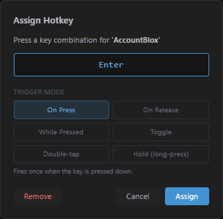<br>
  <sub><i>Capture a key combo and pick a trigger mode.</i></sub>
</p>

- **Hotkey** — right-click a profile → **Assign hotkey**, press the combo (e.g. `Ctrl+Alt+F1`), pick a trigger mode. Fires globally.
- **Hotstring** — assign a typed sequence (e.g. `qqsig`); finishing it runs the profile.
- **Master switch** — `Pause` (or Settings → Profile → Recording → **Profile Keys**) enables/disables **all** hotkeys and hotstrings at once.

### Trigger modes

| Mode | Behavior |
| --- | --- |
| **On Press** | Fires once when the key goes down. |
| **On Release** | Fires once when the key is released (the press is swallowed while held). |
| **While Pressed** | Loops the macro continuously while held; stops on release (autofire). |
| **Toggle** | First press starts (respecting the profile's loops); second press stops. |
| **Double-tap** | Fires once when the key is tapped twice quickly (~0.4 s). Single taps do nothing. |
| **Hold (long-press)** | Fires **once** after the key has been held ~0.6 s; a quick tap does nothing. Unlike *While Pressed*, the run does **not** stop on release. |

> Trigger modes apply to **hotkeys** only. **Hotstrings** always fire when typed.

**Mouse side buttons.** The two side buttons (**XButton1** / **XButton2**, alone or with modifiers)
can be captured as hotkeys just like keys, with every trigger mode above — ideal for click-heavy
game macros. The wheel (`ScrollUp`/`ScrollDown`) also works but always fires On Press.

---

## Automation (fire without a hotkey)

An **Automation** fires a profile by itself — no hotkey press. Manage them in
**Settings → App → Automation → Manage** (or the tray menu → **Automations…**).
Three trigger kinds per profile (one automation each):

| Kind | Fires |
| --- | --- |
| **Interval** | Every N seconds (the field is in seconds; 300 = 5 minutes). The first fire comes one interval after arming. |
| **Schedule** | At a clock time (`HH:mm`) on the weekdays you pick. |
| **Condition** | When a watched condition **becomes true**: a window opens (or comes to the foreground), a process starts, a file appears, a pixel matches a color, an image appears on screen, or the clipboard changes. |

<!-- PICT: automation-panel.png — The whole Automation dialog. On the left: the list of automations with at least one armed row showing the status summary (e.g. "at 08:00 · 3× · next …") plus the Armed toggle and the "Add automation" button. On the right: the editor with a Schedule trigger ("At" 08:00, "Days" with Mon–Fri lit). Footer: the "Automations enabled" master switch plus Close/Save. -->
<p align="center">
  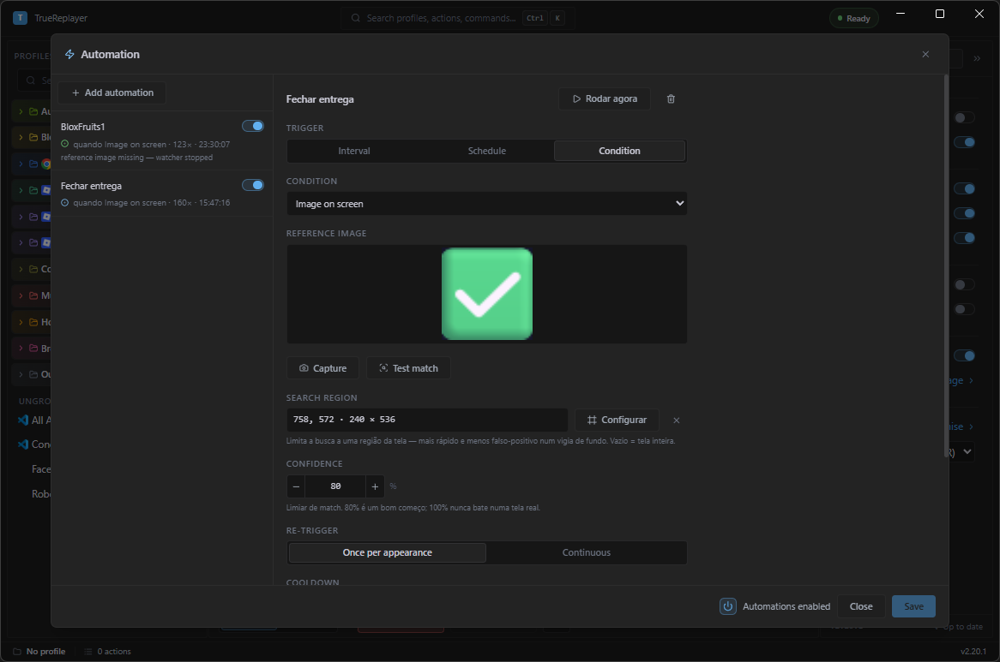<br>
  <sub><i>The list of automations (with the <b>Armed</b> toggle) on the left and the trigger editor on the right.</i></sub>
</p>

How it behaves:

- **Armed** — only armed automations run; they re-arm automatically at startup, so
  *Run on Startup* + *Startup Minimized* turns TrueReplayer into a tray daemon. Arming is
  **local to your machine**: imported, duplicated or copied profiles always arrive disarmed.
- **One run at a time** — there is a single engine, so a fire waits its turn: while a replay or
  recording is running, while you have unsaved edits in the grid, or while a dialog is open, it
  retries for a short window and, if it still doesn't fit, is **skipped** (and counted in the
  panel). An automation never discards your unsaved work.
- **Each fire runs the profile once** — even with the toolbar's **Loops** enabled at `0`
  (= forever). An endless replay started by nobody would own the engine for good, and with the
  app in the tray there is no Stop button within reach.
- **The history survives closing the app** — how many times it fired, when it last did, and how
  many fires were skipped. That is what answers the question only a daemon raises: *did this run
  while I was away?*
- **Condition fires** are edge-based by default: the condition must turn false again before the
  next fire (switch to **Continuous** to re-fire every cooldown while it stays true). A
  **Cooldown** (default 30 s) spaces fires; the clipboard watcher ignores clipboard traffic
  produced by TrueReplayer itself.
- **Master switch** — Settings → App → Automation, mirrored in the tray menu
  (**Enable Automations**). The tray tooltip shows how many automations are armed.
- Profiles without a window target act on whatever window is focused when the trigger fires —
  the editor warns you. Prefer targeted profiles (or *Activate Window* as the first action).

### Checking an automation before you trust it

An automation is the one thing in the app that runs **while you aren't watching**, so the panel
has three controls that stop you finding out about a mistake weeks later.

- **Run now** (top of the editor) — fires the profile **once, immediately**, down the same road
  the trigger would use. The answer appears just below the button. It is not the same as pressing
  Replay: it goes through the same gates an automatic fire does, so it also tells you *why it
  didn't run* — "a replay is already going", "the grid has unsaved changes", "a dialog is open".
  It only works on a **saved** automation: save first.
- **The "can never fire" warning** — if the condition is missing the field it needs (a
  **Window open** with neither process nor title, a **Process running** with no name, a
  **File exists** with no path, an **Image on screen** with no image), the editor says so in red
  and **Save** stays blocked until you fill it in. It used to save, arm, show a live light and
  never fire, with nothing on screen explaining why.
- **Armed, but not watching** — when the toggle is on and yet no watcher is running, the list row
  says so and why: automations are paused at the master switch, the profile is disabled, or the
  watcher stopped itself (reference image gone, condition that cannot match).

The panel also **asks before discarding**: closing, pressing `Esc` or clicking another automation
with unsaved changes opens a confirm (**Keep editing** · **Discard** · **Save and continue**), and
the trash icon wants a **Yes** first. That matters most for the image trigger, where throwing away
the draft costs the capture and the region you just tuned.

### What a watcher costs — the *Check every* field

A **Condition** trigger keeps checking for as long as it's armed, and the cost is per check. It is
not the same for all of them: **Image on screen** captures the whole screen and compares the image
**on every check**, while **Window open** or **File exists** are nearly free.

That's what the **Check every** field is for, in milliseconds, at the end of the condition options.
Leave it at `0` for the default (250 ms for pixel, 500 ms for clipboard, 1 s for everything else).
It's worth raising when the thing you're waiting for is slow: an app opening, a download
finishing, a report that lands at the end of the day. Trading 1 s for 5 s on an image watcher cuts
the cost fivefold and gives up nothing — what you're waiting for won't appear and vanish inside
four seconds.

> With several image watchers armed at once, each one takes its own screen capture. That's where
> raising **Check every** on the ones that aren't in a hurry makes the most difference.

### On-screen image trigger (Image on screen)

Pick **Condition → Image on screen** to fire the profile when something appears on screen. The editor has:

- **Reference image** — click **Capture** (the camera icon) and crop what to watch for on screen; it becomes a thumbnail. Click the thumbnail to **crop tighter** without recapturing.
- **Confidence** — how close the match must be (default **80%**, range 10–99). **Never 100%** — a live screen never reproduces a reference pixel-for-pixel.
- **Search region** — **Full screen** by default. Click **Configure** and drag a box to limit the search to a slice of the screen — faster and with fewer false positives for a watcher that runs all the time. The ✕ clears the region.
- **Test match** — searches the screen **now**: on a hit it shows the percentage and **snaps the region** around the found spot (reads *Found (85%) — region snapped to it*); on a miss, *Not found on screen*.

<!-- PICT: automation-image.png — Automation dialog with Trigger = Condition and Condition = "Image on screen". Show: the filled "Reference image" thumbnail, the "Capture" and "Test match" buttons, a result line "Found (85%) — region snapped to it", the "Search region" field with a defined ROI (e.g. "420, 260 · 320 × 180") with the "Configure" button and the ✕, and the "Confidence" field at 80%. -->
<p align="center">
  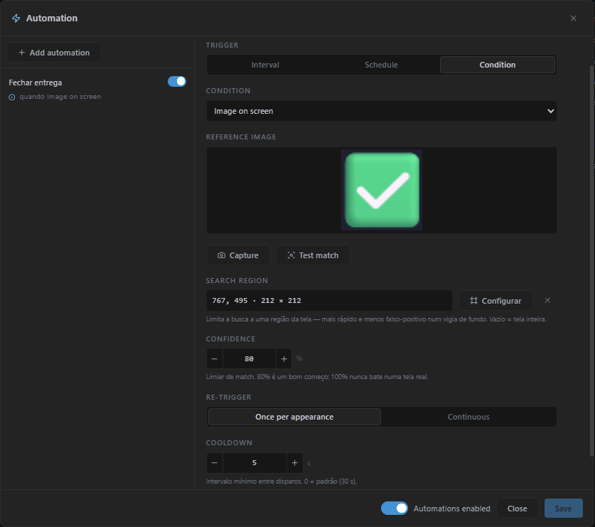<br>
  <sub><i>The <b>Image on screen</b> trigger with search region, confidence and <b>Test match</b>.</i></sub>
</p>

### Worked example — the 8 a.m. macro that runs itself

**The situation.** Every weekday at 8, someone has to open the system and post the shift-opening message. It's the same sequence of clicks, at the same time, every day — and it always depends on somebody remembering. A hotkey doesn't solve it: a hotkey needs a finger on the keyboard.

**Step 1 — open the panel.** Settings → **App** → **Automation** → **Manage ›**. (The tray menu opens it too, under **Automations…**.)

**Step 2 — create the automation.** Click **Add automation** (the button with the + icon) and pick the profile from the list. Only profiles that don't have one yet show up — each profile gets at most one automation.

**Step 3 — pick the trigger.** The **Trigger** field offers three:

| Trigger | Fires | Fields and limits |
| --- | --- | --- |
| **Interval** | Every N seconds (the field is in seconds; 300 = 5 minutes) | **Every** — the field is in **seconds** (`s` suffix): minimum 5, maximum 86,400 (24 h), default 300 (= 5 min). The first fire happens one interval after you arm it. |
| **Schedule** | At a clock time | **At** in `HH:mm` format, plus the **Mon** … **Sun** pills under **Days**. |
| **Condition** | When something becomes true | Six watched conditions: **Window open**, **Process running**, **File exists**, **Pixel color**, **Image on screen**, **Clipboard changed**. |

**Step 4 — set the time.** Choose **Schedule**, type `08:00` in **At**, and click the **Mon** through **Fri** pills in **Days**. Leaving all of them off means **every day**. Click **Save**.

**Step 5 — arm it.** Flip the toggle on the profile's row in the list on the left. It takes effect immediately, independent of **Save**. Check the master switch too — the panel footer labels it **Automations enabled**, while Settings → App → Automation and the tray menu label it **Enable Automations**.

**Step 6 — leave the app on watch.** Settings → **App** → **Startup** → turn on **Run on Startup**, then **Startup Minimized** (the second one stays greyed out while the first is off). TrueReplayer now starts with Windows, disappears into the tray, and re-arms its automations by itself.

That's the difference between the first two: **Interval** counts from the last fire — arm at 9:47 with 5 minutes and it fires at 9:52, 9:57, and the clock times depend on when you flipped the switch. **Schedule** counts by the clock: 08:00 is 08:00, whenever you armed it. Use **Interval** for "every so often", **Schedule** for "every day at 8".

> **The Interval countdown doesn't restart when you close the app.** It picks up where it left off, anchored to the last real fire. That matters for long intervals: "every 12 hours" on a machine you shut down each night used to start over every morning and, in practice, **never fired at all**. If the moment passed while the app was closed it fires 15 seconds after launch — not instantly, so it doesn't jump on you the moment the screen comes up. Re-arming or editing the automation does start a fresh period.

> **A missed Schedule doesn't ambush you later.** If the machine was asleep at 08:00 and you woke it at 18:00, that occurrence is **dropped**, with the reason recorded — a schedule names a *moment*, and running it ten hours late isn't what you asked for. Missed by a few minutes because the app was busy, and it still retries.

> Arming is **local to this machine**. Imported, duplicated or copied profiles always arrive **disarmed** — deliberately, so a profile someone sent you never starts acting on your computer on its own.

> **If it goes wrong.** By far the most common miss: **saving is not arming**. **Save** stores the trigger's configuration; the toggle on the list row is what actually brings the automation to life. If it's armed and still doesn't run, the shortest path is **Run now**: it fires immediately down the same road the trigger uses and writes the reason on screen. An automatic fire is **skipped** when it can't run over your work — while a replay, a recording or Clicker mode is going, while a dialog is open (or you're capturing a hotkey), or while the action list has unsaved edits. It retries for a short window before giving up; a **Schedule** keeps trying for up to 3 minutes and then gives up for the day. Once there are skips, the panel shows a **Skipped fires** line at the bottom of the editor, broken down by reason (*busy* · *unsaved changes* · *dialog open*), and those numbers **don't reset** when you close the app.
>
> The quiet trap: leaving an action edited but unsaved and sending the app to the tray. In that state **no** automation fires, because none of them will run over what you haven't saved — and nothing on screen reminds you. Save the grid before you go.

> **The clipboard watcher goes deaf for a moment after every replay.** That's so TrueReplayer
> doesn't trigger itself on its own pastes. The side effect is that a copy *you* make in that
> window is ignored too — the panel counts those separately, under
> *Clipboard changes ignored just after a replay*.

---

## Key remaps

**Settings → Keys → Key Remaps** — an always-on 1:1 layer, independent of profiles:

- **Remap a key** — e.g. `CapsLock → Esc`: everywhere, while TrueReplayer runs, pressing
  CapsLock types Esc. Mouse side buttons (**XButton1/2**) can be sources too (side button → key).
- **Disable a key** — map it to nothing.
- Remaps **pause automatically while you record** a macro (recordings capture the physical keys)
  and can be paused globally from the tray (**Enable Key Remaps**) — the mouse-only escape hatch
  if a remap ever makes typing awkward.
- Hotstrings follow the **remapped** keystream (what the apps see), and key combos treat a
  remapped modifier as the key it became. A key used as a remap **source** can't also be a
  profile hotkey — the remap wins.

---

## Window targeting & relative coordinates

Tie a profile (or a whole folder) to a specific application window.

<!-- PICT: target.png — The Target Configuration dialog at rest: Process Name, Title (Contains/Regex), the "Detect Window (click on target)" button, "Test front window", the Relative Coordinates / Bring to Focus / Restore Position / Restore Size toggles, the "Update Window Size & Position" button and "Set Target". -->
<p align="center">
  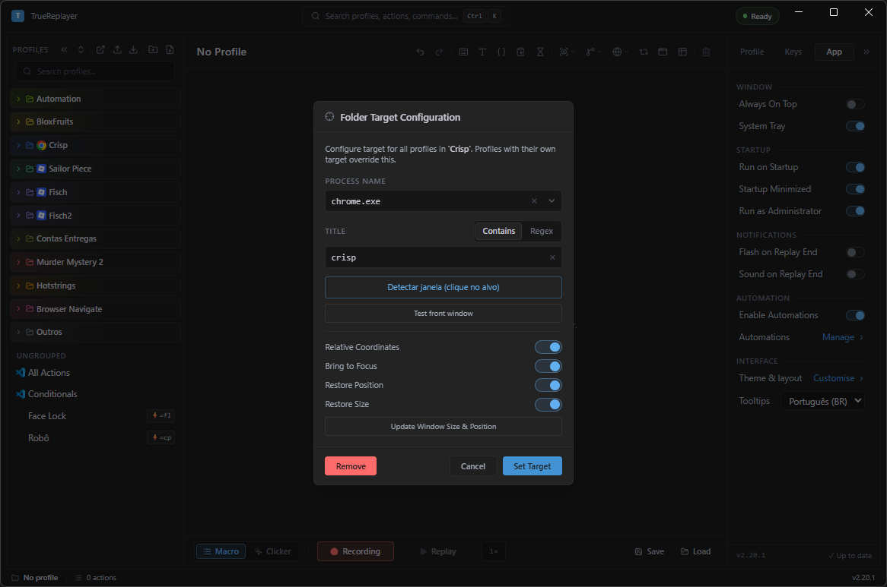<br>
  <sub><i>Match a window by process / title, with relative coordinates and restore options.</i></sub>
</p>

- **Window target** — set a process name and/or window title (match *contains* or *regex*). The profile's **hotkey only fires when that window is in front**. Use **Detect Window (click on target)** to click a window and auto-fill the fields, and **Test front window** to check the match.
- **Relative Coordinates** — store clicks relative to the window's top-left corner instead of the screen, so the macro keeps hitting the right spot when the window moves or resizes. To migrate an already-recorded macro, the dialog offers **Apply target & convert** when you flip the toggle; outside it, right-click the profile → **Convert coords → Relative / Absolute** (or the command palette, `Ctrl+K`).
- **Bring to Focus** — restore + foreground the window before replay.
- **Restore Position / Size** — snap the window back to a saved geometry first (use **Update Window Size & Position** to capture the current one). The same geometry works for a whole **folder** too.

> If a profile uses relative coordinates and its target window isn't found at replay time, replay stops with an error (rather than clicking the wrong place).

### Worked example — the macro that worked yesterday and clicks the wrong place today

**The situation.** You recorded a macro that clicks three buttons inside your company's system, and it ran fine all week. Today it clicked empty space — or worse, the button next door. The macro didn't change: someone dragged the window, snapped it to half the screen, or the macro fired while the browser was in front. A recorded click stores a point **on the screen**, so the window only has to move ten pixels for every click to miss at once.

**Step 1 — name the window.** Right-click the profile → **Window target…** → **Detect Window (click on target)**, then click the real window. **Process Name** and the title fill themselves in (`Esc` cancels detection if you click the wrong one).

**Step 2 — check before you save.** Leave the system visible behind the dialog and hit **Test front window**. It has to read *✓ Matches* with the process name. TrueReplayer's own window is excluded from that test, so the verdict is always about the app behind it. The button resets on its own after a few seconds — just click again. If the title changes with every ticket, start with **Contains**: delete the part that varies and keep only the chunk that never changes — that's enough most of the time. **Regex** is the escape hatch for when the fixed part isn't one single chunk, e.g. when the steady text sits at both the start *and* the end of the title:

```
^Orders .* — Internal System$
```

In plain words: `^` anchors to the start of the title, `Orders ` is literal text, `.*` accepts anything in the middle (the order number, the customer name), ` — Internal System` is literal again, and `$` anchors to the end. So: it matches any title that **starts** with "Orders " and **ends** with " — Internal System".

**Step 3 — turn on Relative Coordinates.** Clicks are now stored against the window's top-left corner instead of the screen — and so are **WaitImage** search regions and **WaitPixel** coordinates, which is why the notice counts "actions" and not just clicks. Since the macro was already recorded, an amber notice appears — *"12 actions captured in absolute coords"* — with two buttons: press **Apply target & convert** to migrate the old actions — that's the label you'll see here, because Step 1's detection counts as editing the target fields. (It reads plain **Convert** only when the target was already saved and you changed nothing but the toggle.) **Skip** leaves the old numbers to be read as if they were already relative, which is exactly how a macro starts clicking in a corner.

**Step 4 (optional) — pin the window down.** In this order:

1. Turn on **Bring to Focus**, so the window comes to the front before a run.
2. If the app needs a particular size, arrange the window the way you want it and click **Update Window Size & Position** to capture the geometry.
3. Only then turn on **Restore Position** and **Restore Size**. Turning on **Restore Position** with nothing captured moves the window to the top-left corner of the screen (the saved X/Y default to 0,0); **Restore Size** with nothing captured simply does nothing.

**Step 5 — click Set Target.** This step is not optional: **nothing** from the earlier steps is written to the profile until you click it. Until that click the target and the toggles live only in the dialog, and closing it throws them away. (The one exception is **Update Window Size & Position**, which writes the geometry straight away.)

That's the difference between the two: **Relative Coordinates** lets the macro *follow* the window wherever it sits; **Restore Position / Size** *puts the window back* to a saved size and spot before anything starts. Together they're belt and braces — the second one earns its keep when the app's layout reflows with the window width.

> Once a target is set, the profile's **hotkey only fires when that window is in front** — *unless* you also turn on **Bring to Focus** (Step 4), which exempts the profile from the gate entirely and lets the hotkey fire from any window. Without it, no more "I pressed it by accident and the macro typed into my editor". And if the profile uses relative coordinates and the window isn't found at replay time, the run **stops with an error** (*Target window 'x' not found — open it and retry*) instead of clicking somewhere random.

> **If it goes wrong.** Two things look like a frozen dialog and aren't. First: the **Relative Coordinates** toggle stays greyed out and won't switch on while **Process Name** and the title are both empty — relative coordinates need a window to hang off, so fill the target in first. Second: while the conversion notice is up, **Set Target** is disabled — you have to pick **Apply target & convert** or **Skip** before you can save. Hover it and the tooltip says so.

---

## Multi-window automation (Activate Window)

The **Activate Window** action switches which app is in front *mid-run*, so one macro can drive several windows in turn. It's distinct from the profile-level [Window targeting](#window-targeting--relative-coordinates) above: that pins a *whole profile* to one window (and gates its hotkey); this is a single **action** you drop into the grid at each app switch.

**It changes only the OS foreground — never your coordinate context.** Clicks keep resolving against the profile's target (or the screen, when there's none), so the pattern you pick depends on whether the steps after a switch need clicks *relative to that new window*:

- **Simple multi-window (absolute clicks).** Leave the profile with **no target**, record clicks in absolute screen coordinates, and drop an **Activate Window** row before each app's steps. Fill **Path** so it launches the app if it isn't already open; leave Path empty to just wait-and-focus an already-running window.
- **Precision multi-window (relative clicks per window).** Make a target-less **orchestrator** profile that alternates **Activate Window X (launch)** → **Run Profile "X-steps"**, where each sub-profile owns *its own* window target + relative coordinates. Activating X first guarantees the sub-profile's target exists before its first relative click.
- **Return to your own window.** An **Activate Window** pointing at the profile's own target is a mid-run "come back here" step after a detour into another app.

**Fields.** The **Action** selector decides what to do with the window: **Activate** (bring it to the front — launching the app first if needed), **Maximize** (focus and maximize), **Minimize** or **Close** (asks the app to close). **Launch** (Path/Args) and **Placement** show only for Activate/Maximize; **Placement** (chips) only for Activate. Identify the window by **Process** and/or **Title** (Contains or Regex) — use the **picker** to choose a running process, or **Detect Window (click on target)** to click the target. If several windows match, **Match #** picks the Nth (1 = the frontmost). **Path / Args** launch the app when no window matches (a full path is safest; a bare `app.exe` only resolves if it's on `PATH`). In **Placement**, the **Position** and **Size** chips are independent; turn one on to reveal the **X / Y / Width / Height** fields, and **Capture from window** reads the window's current rectangle — positional only, it doesn't change where clicks land. **Timeout / On Timeout** decide how long to wait and whether to **Halt** (default — safe, since keystrokes follow whatever window is focused) or **Continue** if the window can't be found or focused. **Test** checks whether a matching window exists right now (shows *Found — process · title* or *Not found*).

<!-- PICT: activate-window.png — Sheet panel with an Activate Window action selected and Action = Activate, showing the full set: the "Action" selector (Activate/Maximize/Minimize/Close), the "Match Window" block (Process Name with the process picker, Title with Contains/Regex, and the "Detect Window (click on target)" button), the "Match #" field, the "Launch" Path (with "Browse…") + Args, the "Placement" row with the Position/Size chips, the "Test" button, and "Timeout" + "On Timeout" (Halt/Continue). -->
<p align="center">
  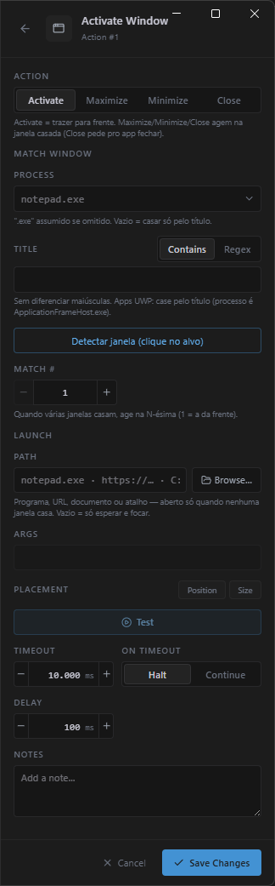<br>
  <sub><i>The <b>Action</b> verb (Activate/Maximize/Minimize/Close) and the window-matching fields.</i></sub>
</p>

---

## Clicker mode (auto-clicker)

Switch to **Clicker** with **`ScrollLock`** (or the Macro/Clicker toggle). The Profile panel swaps to clicker settings:

| Setting | What it does | Default |
| --- | --- | --- |
| **Button** | Left / Right / Middle. | Left |
| **Rate** | Click speed, as a delay (ms) or clicks/second. | 100 ms (10/s) |
| **Loops** | Number of clicks. **0 = infinite.** | 0 |
| **Interval** | Pause between loop iterations. | off |
| **Jitter** | Random ± % on the delay. | off |
| **Position** | Randomize the click position slightly. | off |
| **Area** | Drag a rectangle to click random points inside it. | off |
| **Fixed** | Always clicks **one** point. With no point set, it locks to the cursor position when the click starts (*At start*); click the chip body to pick the point on screen. | off |

> **Position, Area and Fixed are mutually exclusive** — turning one on turns off the other two.

Start/stop with **`PageDown`**, pause/resume with **`PageUp`**. While running, the **live dashboard** shows the click count, rate, elapsed time, loop progress and ETA.

<!-- PICT: clicker.png — The Clicker panel LIVE while running (press PageDown to start): the big click count, rate, elapsed time, loop progress, ETA and the progress bar — with the Clicker settings (Button · Rate · Loops · Interval · Jitter · Position · Area · Fixed) visible in the right-hand panel. -->
<p align="center">
  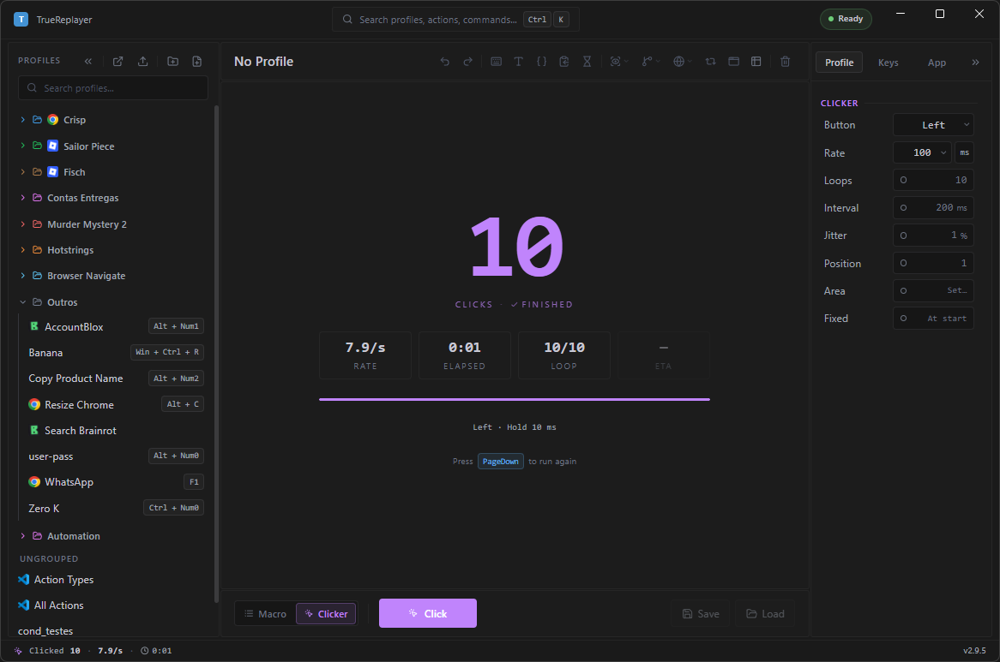<br>
  <sub><i>Live count, rate, ETA and the progress bar — and the settings (incl. <b>Fixed</b>) on the right.</i></sub>
</p>

---

## Game mode

For games (e.g. Roblox) that ignore an instant cursor "teleport", *Game mode* makes the movement look human. It's **on by default**; turn it off for normal apps that don't need it.

- **Smooth movement** — walks the cursor to the target in small steps (tune **Path step** px, **Step delay**, **Click delay**). Defaults: 20 px / 2 ms / 10 ms.
- **Fast approach** — for long moves, teleports invisibly to within **Settle distance** (default 80 px) of the target, then walks the final stretch — so far clicks stay quick.
- **Focus-click** *(per action)* — some tiny targets (a small Roblox text field) only take keyboard focus on a *second* click. Toggle **Focus click** on a click row (right-click) and it clicks twice a few pixels apart. **Use it only on small text fields, never on buttons** (a button would fire twice).

---

## Send Text

The **Insert Text** editor composes text that's injected via clipboard paste (so layouts and special characters survive).

<!-- PICT: sendtext.png — The "Insert Text" editor (opened from toolbar → Send Text). Right-hand rail on the "Insert" tab, scrolled to show the FOUR sections with headings: Clipboard (chips Clipboard, Advanced…, Clip slot…, Clipboard history), Values (Date, Time, DateTime, Random), Keys & timing (Enter, Tab, Delay + More keys) and Run state (Variable…, Counter, Action row #, Row column…, Row column (next)…, Ask input…). Replaces the old image, from before the winclip/rownext chips. -->
<p align="center">
  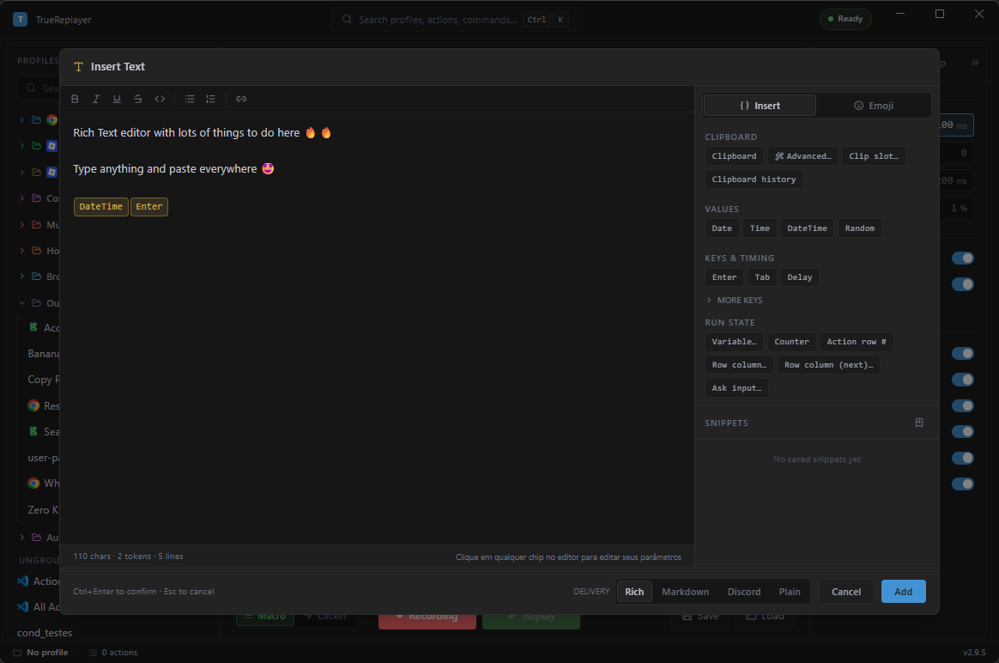<br>
  <sub><i>Editable token chips inline, with the Clipboard · Values · Keys &amp; timing · Run state sections on the side.</i></sub>
</p>

- **Tokens** — embed special keys and values: `{enter}`, `{tab}`, `{space}`, arrows and other keys; `{date}` / `{time}` / `{datetime}`; `{delay:500}` to pause mid-text. Repeatable keys take a count: `{enter:3}`.
- **Clipboard** — `{clipboard}` inserts the current clipboard; `{clipboard:upper}`, `{clipboard:trim}`, `{clipboard:line:1}` etc. transform it (trim → extract → limit → case order). Your real clipboard is restored afterward.
- **One line per use** — `{clipboard:next}` pastes **only the next line** of what you copied and advances by itself: the first use emits line 1, the next one line 2, and so on. Copy a list of 30 codes in one go and a hotkey starts dispensing them one per press, with you never touching the clipboard again. It's the sibling of Data Loop's `{rownext:column}` — same idea, only the data comes from the clipboard instead of a table. Details below.
- **Clipboard history** — `{winclip:1}` inserts the **most recent** item copied in Windows, `{winclip:2}` the one before it, and so on (it's the `Win+V` history, so it must be enabled in Windows settings). `{winclip}` alone means `{winclip:1}`. It's different from the `{clip:N}` slots: `{winclip}` reads the system history, `{clip}` reads what *you* captured in the app.
- **Run-state tokens** — `{var:name}`, `{clip:name}`, `{input:Label}`, `{counter}`, `{row:column}` and `{rownext:column}` pull in values from the running macro; see [Variables, slots & prompts](#variables-slots--prompts) and [Data Loop](#data-loop).
- **Token chips** — each token shows as an editable chip; click it to tweak its parameters.
- **Snippets** — save reusable text under a name for quick insertion later. Snippets live in the app, not in the profile, so they don't travel with export/import.
- Confirm with **`Ctrl+Enter`** (plain `Enter` makes a new line); `Esc` cancels.

The **Advanced…** chip opens a `{clipboard}` transform builder with a live preview — trim, line ops (sort, dedupe, reverse, join), extract line/word, limit length and case — that assembles the `{clipboard:mods}` chain for you without memorizing the syntax. Its first section, **Sequence**, is the **One line per use** checkbox (the `next`).

<!-- PICT: advanced-clipboard.png — The "Advanced Clipboard" editor (the Advanced… chip in Insert Text): the TRIM, LINES, EXTRACT, LIMIT LENGTH, CASE steps on the left and the CLIPBOARD NOW / RESULT / TOKEN preview on the right. -->
<p align="center">
  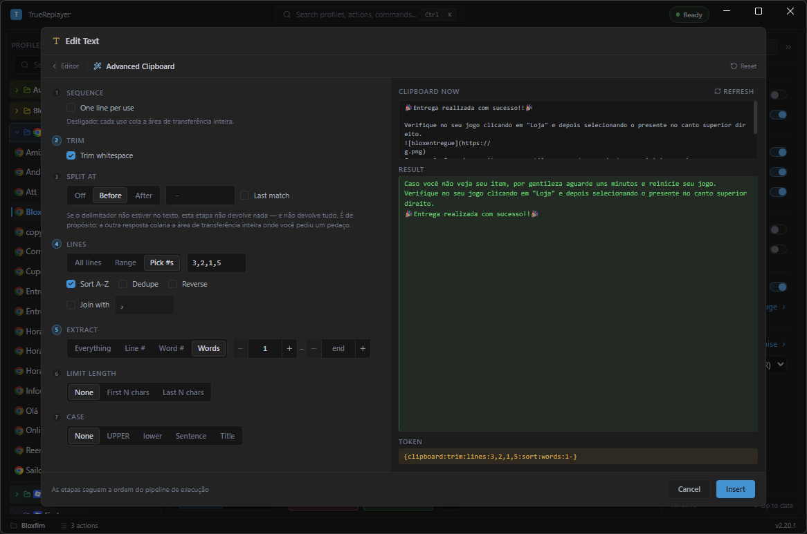<br>
  <sub><i>The <b>Advanced…</b> builds the <code>{clipboard:mods}</code> chain step by step, with a live preview.</i></sub>
</p>

### One line per use — `{clipboard:next}`

Normally `{clipboard}` pastes **everything** you copied. With `next`, it pastes **one line and remembers where it stopped**:

```
{clipboard:next}
```

Copy a whole spreadsheet column (30 codes, 30 lines), fire the macro, and out comes the first code. Fire it again and out comes the second. No going back to the spreadsheet, no re-copying, no macro-per-line built from `{clipboard:line:1}`, `line:2`, `line:3`.

Turn it on from the **Advanced…** chip → **Sequence** section → **One line per use**, or just type `next` yourself.

- **How it remembers.** The position is tied to **the content you copied**. Copy something else → the count restarts at line 1 by itself. Copy the same list back → it picks up where it left off. There's nothing to "reset".
- **Blank lines are skipped.** A list pasted out of a spreadsheet usually carries empty lines at the end; they don't burn a use.
- **At the end it stops producing** — the token resolves to empty text instead of wrapping around. That's deliberate: wrapping silently would make the macro reprocess the whole list with nobody noticing.
- **It combines with the other modifiers**, and `next` always runs **first**: `{clipboard:next:trim:upper}` takes the next line and *then* transforms **that line**. The order you write them in doesn't matter — `{clipboard:trim:next}` does the same thing.
- **Several `{clipboard:next}` in one macro** consume one line each, in order: two of them in a Send Text fill two fields with lines 1 and 2, and the next run takes 3 and 4.

> **Which of the three.** `{clipboard:line:3}` = *always* the third line. `{clipboard:next}` = the **next** line of whatever is copied. `{rownext:column}` = the next row of the profile's **data table** (see [Data Loop](#data-loop)) — that one survives closing the app; the clipboard one lasts as long as TrueReplayer is open.

### When the number comes from a variable — `@i`

Wherever a modifier takes a number, that number can come from a **variable** instead of being
fixed. Write `@` followed by the name:

```
Set Variable   i = 3
Send Text      {clipboard:line:@i}      →  the third line
```

Besides your own variables, two names come ready-made:

| You write | Where the number comes from |
| --- | --- |
| `@name` | The variable with that name (the same one `{var:name}` reads) |
| `@counter` | The current loop pass — 1, 2, 3… |
| `@row` | The current data-table row |

It's for the case where the line you want **changes every pass**: inside a loop,
`{clipboard:line:@counter}` takes line 1 on the first pass, line 2 on the second, and so on.

- Works on **Line #**, **Word #**, **First N** and **Last N**, in `{clipboard}` as well as
  `{row:column}` and `{rownext:column}`.
- In the **Advanced…** window, the little **@** button beside the field switches between a fixed
  number and a variable. With it on, the preview stops showing a result and says *"Resolved when
  the macro runs"* — it has no way to know the value, and an invented number there would be worse
  than none.
- **An unknown name yields empty**, deliberately. The alternative would be pasting the whole
  clipboard because of one mistyped name, into a customer reply.
- **Join** does not take `@`: there the text is the literal separator, so `join:@x` joins with `@x`.

> This is not the same as writing `{clipboard:line:{var:i}}` with braces — that form does **not**
> work and never did: it pastes the whole clipboard followed by a stray brace. The `@` spelling
> exists precisely because the brace one would change the meaning of tokens already saved in your
> profiles.

**Delivery** decides how the formatting arrives, since every app understands something different:

| Mode | Sends |
| --- | --- |
| **Rich** | Real formatting (bold, lists, links) where the target accepts it — email clients, docs, most web editors. |
| **Markdown** | The `*bold*` / `_italic_` style WhatsApp-like apps expect. |
| **Discord** | Discord's own flavour (`**bold**`, `~~strike~~`). |
| **Plain** | Plain characters only — safest for search boxes, game chats and code fields. |

### Worked example — the reply you retype twenty times a day

**The situation.** Every day you send the same support reply, changing only the person's name and the time. Twenty-odd times a day: copy the name from the ticket, retype the text, check you didn't fumble a word, glance at the clock to write the timestamp. Five lines you know by heart, rewritten from scratch every single time.

**Step 1 — open the editor.** Toolbar → the **Send Text** button (a "T" icon; the name only shows on hover). The window that opens is titled **Insert Text** — same thing. Write the body of the message normally, as if you were typing it into the chat.

**Step 2 — drop tokens where the text changes.** In the right-hand panel, **Insert** tab, the chips sit in sections:

- **Clipboard** — **Clipboard** (`{clipboard}`), **Advanced…** (builds transforms like `{clipboard:trim}`), **Clip slot…** (inserts `{clip:name}` from a slot you captured) and **Clipboard history** (inserts `{winclip:1}`, the Windows history).
- **Values** — **Date**, **Time**, **DateTime** and **Random**.
- **Keys & timing** — **Enter**, **Tab** and **Delay** (`{delay:500}`), plus a **More keys** toggle for the rarer keys.
- **Run state** — **Variable…**, **Counter**, **Action row #** (`{row}` — the row number *of the action* in the grid), **Row column…** (`{row:column}`), **Row column (next)…** (`{rownext:column}` — the *next* row on each use) and **Ask input…** (`{input:…}`).

Click a chip and it lands at the cursor. The body ends up like this:

```
Hi {clipboard:trim}, how are you?
We got your ticket and we're on it.
You'll hear back within 2 business hours.
Logged at {datetime}.{delay:500}{enter}
```

**Step 3 — pick the Delivery.** At the bottom of the dialog, to the left of the **Cancel** and **Add** buttons, sits the **Delivery** selector: **Rich** for email and docs, **Markdown** for WhatsApp, **Discord** for Discord, **Plain** for search boxes and game chat. It ships on **Rich**.

**Step 4 — save it as a Snippet**, while the text is still on screen. At the bottom of the right-hand panel find **Snippets** and click the bookmark icon next to it. Give it a name (`standard-reply`) → **Save**. From then on, clicking that name in the list inserts the whole text, tokens and formatting included, into the **Insert Text** editor.

**Step 5 — confirm with `Ctrl+Enter`.** Plain `Enter` makes a new line inside the text; `Ctrl+Enter` — or the **Add** button in the bottom-right corner — is what closes the box and saves the action. `Esc` or **Cancel** discards.

**When you actually use it:** `{clipboard:trim}` picks up whatever is copied *at that moment*. So the gesture is always the same: select the customer's name, copy it with `Ctrl+C`, and only then fire the macro. Fire it with nothing copied and the message goes out with a hole where the name should be.

> **Every app understands a different flavour.** If the message arrives showing the asterisks on screen (`*bold*` instead of bold), you sent **Markdown** (or **Discord**) to an app that doesn't parse those marks — switch to **Rich** or **Plain**. If the opposite happens and the formatting vanishes entirely, the target won't take rich text: WhatsApp wants **Markdown**, Discord wants **Discord**, Gmail and Word want **Rich**. Test it once per app you use and you're set.

That's the difference between the two: a **Snippet** is a shortcut for *writing* — it saves you retyping while you build the action; the **Send Text** action saved in the profile is what actually *runs*. One is for you, the other is for the machine.

> **If it goes wrong.** Snippets are stored in the app, not in the profile. Export the profile and open it on another machine and the message travels fine (the text lives inside the action), but the **Snippets** list shows up empty over there — it doesn't travel with export/import. Worth recreating the snippets on the new machine. The other common stumble is pressing `Enter` thinking you confirmed: it only makes a new line, and the text sits there unsaved.

---

## Variables, slots & prompts

Three ways to make one macro handle changing values instead of writing a new macro per case.

| Tool | Lives for | Read it with |
| --- | --- | --- |
| **Set Variable** | The current run (cleared when it starts). | `{var:name}` |
| **Copy to Slot** action / **Capture Slot** hotkey | Until you record over it — kept from one run to the next, for as long as the app stays open. | `{clip:name}` or `{clip:1}`…`{clip:9}` |
| **`{input:Label}`** | Asked once per run, then remembered for that run. | Type the token itself |

### Quick reference — each token and what it becomes

Minimal examples. All of them can go inside a **Send Text** (or in a Keystroke's key, or a browser field).

| You write | What comes out at run time |
| --- | --- |
| `{var:customer}` | The value stored by a **Set Variable** named `customer` (empty if it was never set). |
| `{clip:1}` … `{clip:9}` | The text you captured in numbered slot 1…9. |
| `{clip:order}` | The text in the slot named `order` (from a **Copy to Slot** action). |
| `{input:Order number}` | Opens a box asking "Order number" and types your answer. |
| `{input:Priority\|menu:Low,Medium,High}` | Opens a pick-list and types the one you click. |
| `{counter}` | The current loop pass number: `1`, `2`, `3`… (empty on a single run). |
| `{winclip:1}` | The most recent item copied in Windows (the `Win+V` history). |
| `{clipboard}` | Whatever is copied right now (`{clipboard:trim}` drops stray spaces). |
| `{clipboard:next}` | The **next line** of what's copied — every use advances one line (see [Send Text](#send-text)). |
| `{clipboard:line:@i}` | The line whose number is in the variable `i` (`@counter` = the loop pass, `@row` = the data row). |

> **Golden rule:** a token that finds no value becomes **empty text** — it never errors. If something comes out blank, press **`Ctrl+K`** → **Toggle Live Variables** and run again to see what's actually stored.

**Set Variable** *(toolbar)* — give it a **Variable Name** and a **Value**; the value is resolved first, so it can contain `{clipboard}`, `{row:col}`, `{date}` or another `{var:}`. Storing an empty value deletes the variable. In the **Mode** selector, switch from **Set** (default) to **Cycle**: the value field becomes **List (one item per line)** and each run stores the **next** line, wrapping to the first at the end — so a hotkey walks the list one item per press. That position is **saved to disk**: closing and reopening the app won't restart the list at item 1. To start over on purpose, right-click the **Set Variable** row in the action grid → **Reset cycle position**.

**Copy to Slot** *(toolbar)* — has a **Mode** selector with two options:

- **Capture** (default) — copies whatever is **selected** in the focused app into the slot named in **Slot**. Make sure the text is actually selected first (a `Ctrl+A` keystroke just before it, for example). A failed grab leaves the previous value in place instead of wiping it.
- **Clear** — **empties** the slot named in **Slot**. Leave the field **blank** to clear **all** slots (1 to 9) and also reset the **Capture Slot** hotkey cursor back to slot 1. Clear mode types and pastes nothing and doesn't touch the Windows clipboard.

<!-- PICT: copy-to-slot-clear.png — The Copy to Slot editor (Sheet panel on the right) with the Mode selector on "Clear" and the Slot field BLANK (placeholder "all slots"), showing the explanatory card "Empties the slot above — or ALL slots (1–9) if the name is blank…". -->
<p align="center">
  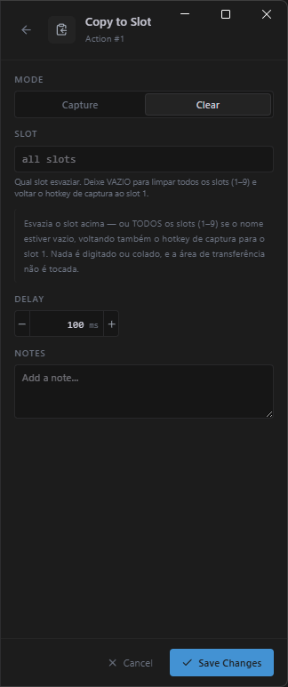<br>
  <sub><i>The <b>Clear</b> mode empties one slot — or all of them, if the name is left blank.</i></sub>
</p>

**Capture Slot** *(hotkey)* — the by-hand version, already bound to `Win+Ctrl+C`: go to Settings → **Keys** → **Hotkeys** → **Capture Slot** to change the combo, or clear the field to switch it off. Each press stores the current selection into the next numbered slot, `{clip:1}` through `{clip:9}`, wrapping; a toast tells you which slot it landed in. It's ignored while a macro is running — use the **Copy to Slot** action there instead.

**`{input:Label}`** — pauses the run and asks you for the value: `{input:Order number}` shows a text box (titled **Input needed**) and `{input:Priority|menu:Low,Medium,High}` shows a pick-list to click. You're asked once per label per run; reuse the same `{input:Order number}` later and it repeats the answer without asking again. When it asks, TrueReplayer **brings itself to the front** on its own (even minimized or hidden in the tray) and, once you answer, **hands focus back** to the window that was in front — so the answer lands in the right app, not in TrueReplayer. Closing the box (**Esc** / **Cancel**) **stops the macro**, and if nobody answers within **60 seconds** the run is aborted (so an unattended automation doesn't hang forever).

<!-- PICT: ask-input.png — The "Input needed" box during a run, triggered by {input:Label}: title "Input needed", the label, the text field and Cancel/Submit, with the footer "Enter to submit · Esc cancels the run". -->
<p align="center">
  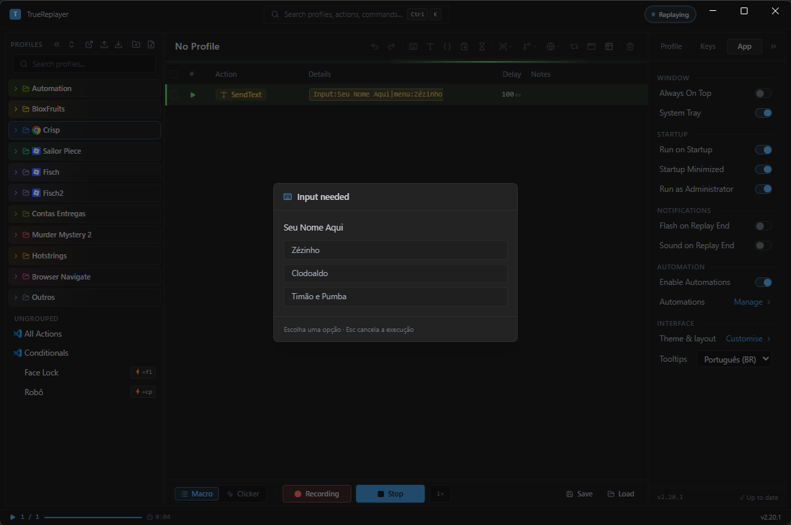<br>
  <sub><i><code>{input:Label}</code> opens this box and types your answer into the right app. With <code>|menu:…</code>, it becomes a pick-list to click.</i></sub>
</p>

**`{counter}`** — the current loop iteration number, handy for numbering output.

> **Seeing what's set.** Press **`Ctrl+K`** → **Toggle Live Variables** to open a small card that shows every variable, every slot and the current data row *while the macro runs* — the quickest way to debug a token that resolves to nothing.

<!-- PICT: live-variables.png — The floating Live Variables card open during a run (Ctrl+K → Toggle Live Variables), showing the "Live Variables" header and the Variables / Slots / Current row sections with a few values in each. -->
<p align="center">
  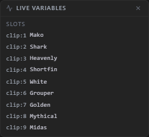<br>
  <sub><i>Variables, slots and the current data row, live while the macro runs.</i></sub>
</p>

### Worked example — collecting three scattered values

**The situation.** To close an order you need to send one message containing three values that live on three different screens: the customer's name in the ticket, the order number in the admin panel, and the delivery code on the supplier's page. Copying them one at a time means three round trips between windows — and getting the order wrong means starting over.

**Step 1 — check the hotkey (once).** It already ships bound to `Win+Ctrl+C`. To use a different combo, go to Settings → **Keys** → **Hotkeys** → **Capture Slot** and press the one you want.

**Step 2 — collect the three values.** Just select and press; no pasting anywhere:

1. Select the customer's name → `Win+Ctrl+C`. A toast reads *Selection captured → {clip:1}*.
2. Select the order number → `Win+Ctrl+C` → becomes `{clip:2}`.
3. Select the delivery code → `Win+Ctrl+C` → becomes `{clip:3}`.

**Step 3 — write the message once.** Make a profile with one **Send Text** action:

```
Hi {clip:1}, your order {clip:2} has shipped!
Delivery code: {clip:3}
Any questions, just ask. {enter}
```

Give that profile a hotkey (right-click the profile → **Assign hotkey…**) and you're done: three taps to collect, one to send.

> Slots stay put from one run to the next: collect the three values now and run the macro a while later. They only change when you record something over them — but they are gone once you **close the app**.

**An alternative path — when the values are always in the same place.** Then you can automate the collecting too, and the three steps above stop being necessary: instead of the hotkey, use the **Copy to Slot** action inside the macro, with a name instead of a number:

1. A click (or a `Ctrl+A`) that leaves the text **selected**.
2. Toolbar → **Copy to Slot** → in **Slot**, type `order`.
3. Later on, use `{clip:order}`.

That's the difference between the two: the **hotkey** is for when *you* pick what to copy, on the spot; the **action** is for when the macro always finds the value in the same corner of the screen — and it's the only one that works *during* a run, since the hotkey is blocked while a macro is playing.

> **The numbers carry on from where they stopped.** The counter doesn't reset to 1 on its own: if you already captured two things today, the next one lands in `{clip:3}`, not `{clip:1}`. The toast always tells you where it landed — and **`Ctrl+K`** → **Toggle Live Variables** shows the whole list. When in doubt, capture all three in one go, in order, and use the numbers the toasts report.

> **If it goes wrong — a slot came back empty.** Both of them copy by sending a `Ctrl+C` to the focused app, so **the text has to be selected** first. If nothing is copied, the slot keeps its previous value (it never goes blank) and the hotkey's counter **does not advance** — just select properly and press again, without worrying that you skipped a number.

---

## Data Loop

Run the whole profile once for **each row** of a table — mail-merge style. Paste rows from Excel or a CSV, and every column header becomes a `{row:column}` token you drop into text, keystrokes or browser fields.

Open it from the **toolbar** (the table icon → *Data Loop*). The table is saved **inside the profile**, so it travels with export/import — a large table grows the profile file.

<!-- PICT: data-loop.png — The Data Loop panel open with a small sample table (header "product | price" + 3 rows). Leave "Loop over data" TICKED so the blue notice "N iterations — one full run per row" appears along with the "On row error" control (Halt / Skip row), and the "Columns · tokens" list on the right showing the {row:product}/{row:price} chips with the ×N / unused counts. -->
<p align="center">
  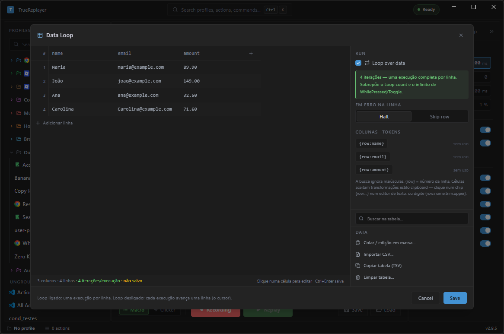<br>
  <sub><i>The table, the <b>Loop over data</b> mode and the column tokens on the right.</i></sub>
</p>

### Getting data in

- **Paste from Excel / Sheets** — **Paste / bulk edit…**, drop a copied range into the box, and pick **Replace table** or **Append rows**. Tabs, quotes and multi-line cells survive the paste. **First row is the header** turns the top line into column names (off → columns become `col1…colN` and every line is data).
- **Import CSV** — **Import CSV…** loads a `.csv` / `.tsv` / `.txt` file; the delimiter is auto-detected (comma, semicolon — as Brazilian Excel writes — or tab).
- **Edit in place** — click any cell to edit it; **Add row** / **Add column**, duplicate or delete rows, and the header **⋯** menu inserts / moves / renames / deletes columns. `Ctrl+Z` undoes the last grid change.
- **Copy back out** — **Copy table (TSV)** puts the whole grid on the clipboard to paste straight into Excel/Sheets. **Clear table…** empties it (saving an empty grid removes the table from the profile).

### Headers → tokens

Every column header becomes a token you can paste into **Insert Text**, a **Keystroke** key, or **Browser Type**:

| Token | Resolves to |
| --- | --- |
| `{row:column}` | The **current** row's value in that **column** — the *same* row for every action in a run (lookup is case-insensitive). |
| `{rownext:column}` | The **next** row of that column on each use: the 1st time takes row 1, the 2nd takes row 2, and so on. Resets each run; past the last row it comes out **empty** (it doesn't wrap). |
| `{row}` | The row number **of the current action in the grid** (1-based) — nothing to do with the data table. |

> **`{row:col}` vs `{rownext:col}` — the difference that matters.** Think of the **columns** as fields and the **rows** as a list. Use `{row:col}` when each run fills *one* record (several columns, same row) — it's the natural partner of **Loop over data**. Use `{rownext:col}` when you want to dump the *whole list* in one pass: three `Send Text` actions with `{rownext:name}` type row 1, row 2 and row 3 in a row. Both tokens accept the same modifiers (`{rownext:name:trim:upper}`).

- Copy a token from the **Columns · tokens** rail (click the chip) or the header **⋯** menu. The rail also shows how many actions use each column (`×N` / *unused*), and flags **orphans** — a `{row:…}` an action references but the table has no such column (it types empty text).
- Headers must be **letters, digits or `_`** to work as tokens. An invalid header is flagged ⚠; click the **wand** to auto-fix it (it still saves either way).
- A missing cell — or a `{row:column}` with no matching header — resolves to **empty text**, never an error. With duplicate columns, the **last** one wins.

### Running over the data

The **Loop over data** toggle decides how the table drives replay:

| Mode | Behavior |
| --- | --- |
| **Loop over data ON** | One **full run per row** — an N-row table = N iterations. **Overrides** the profile's Loop count *and* a While-Pressed / Toggle infinite replay. Replay **refuses to start** if the table has no rows. |
| **Loop over data OFF** (*cursor*) | Each replay uses the **next row** and advances, **wrapping** back to the top at the end — good for "process one record per hotkey press". Right-click any row → **Reset row position** to start over at row 1. **Notify on list complete** (rail checkbox, on by default) chimes when a run uses the **last** row, so the wrap isn't silent. |

> The row is chosen **once per run**, so a profile with its own inner Loop count repeats the *same* row that many times before moving to the next.

> **The position is saved to disk.** This cursor — and the **Set Variable** *Cycle* one — **survives closing the app**. You can work 12 rows of a 40-row list today, shut the machine down, and tomorrow's first run picks up at row 13. (They used to live in memory only, so any restart silently went back to row 1 and you redid work you'd already done.) To start over on purpose, use **Reset row position** / **Reset cycle position** from the right-click menu.

### Skip on error (loop-over-data only)

When looping over data, **On row error** decides what a failed row does:

| Policy | Behavior |
| --- | --- |
| **Halt** *(default)* | Stop the replay on the first row that errors. |
| **Skip row** | Log the failed row, release anything it left held, and continue with the next row. A one-line summary at the end reports how many rows were skipped (and the first reason). |

### Cell transforms — `{row:column:mods}`

A `{row:column}` token — and `{rownext:column}` too — accepts the **same modifier chain as `{clipboard}`** (see [Send Text](#send-text)) — append the modifiers after the column name, e.g. `{row:name:trim:upper}`. Click a `{row:…}` chip inside a text editor to configure them in a popover with a live preview of the first row's value, or type the chain by hand. The pipeline runs in a fixed order: **trim → list ops (range / lines / sort / dedupe / reverse / join) → extract (line / word) → limit (first / last) → case (upper / lower / sentence / title)**.

### Run a sub-profile once per row

A **Run Profile** action can tick **Run once per data row**: the *called* profile runs once per
row of **its own** Data table, with `{row:column}` resolving from that row — so a parent macro
can do its setup once, then batch a sub-profile over a list mid-run (Repeat is ignored while
this is on). If the called profile's table opts into **Skip row**, failed rows are skipped and
summarized exactly like a top-level data loop; with no table, the sub-profile just runs once.

### Worked example — registering a list of products in a form

**The situation.** Every week a spreadsheet lands with 40-odd new products to register in a web system. It's always the same clicks: open the form, type the name, type the price, save. Only the typing changes. Doing it 40 times by hand eats an afternoon — and that's where the typos come from.

**Step 1 — build the macro for ONE product.** Record (or assemble) the actions normally, actually typing the name and price of some product. Test it until one run goes through cleanly. That's your template.

**Step 2 — bring in the spreadsheet.** Toolbar → table icon (**Data Loop**) → **Paste / bulk edit…**. Copy the range in Excel, drop it in the box, leave **First row is the header** ticked and click **Replace table**:

| product | price |
| --- | --- |
| HDMI cable 2m | 39.90 |
| Wireless mouse | 89.00 |
| ABNT2 keyboard | 129.90 |

Headers only become tokens if they're letters, digits or `_` — no accents, no spaces. A header that breaks the rule gets a ⚠ right in the paste preview (it still saves — it just won't work as a token). The **wand** that renames it in one click lives afterwards, in the right-hand **Columns · tokens** list.

**Step 3 — swap the fixed values for tokens.** In the **Columns · tokens** rail, click the `{row:product}` chip to copy it. Open the **Send Text** action that typed the name, delete the fixed text and paste the token in its place. Do the same with `{row:price}`. Then check the rail: each column should read `×1` instead of *unused*.

**Step 4 — turn the loop on.** Tick **Loop over data**, set **On row error** → **Skip row**, and click **Save**. Done: one hotkey press registers the whole spreadsheet, and if one product fails it gets logged and the macro moves on to the next (a line at the end reports how many rows were skipped, and the first reason).

> With **Loop over data** on, the table is in charge: it **overrides** the profile's **Loops** count (Settings → Profile → Execution → **Loops**) and a While-Pressed / Toggle infinite replay too — 40 rows = 40 runs, no more, no less. And if the table is empty, replay **won't even start**: you get *The data table has no rows*.

That's the difference between the two modes: with **Loop over data** on, the macro chews through the whole list in one go; with it off, each hotkey press handles **one** row and advances, and after the last one it starts again at the first — that's for working item by item, at your own pace.

> **If it goes wrong.** The usual mix-up: the table is right there, the macro runs… and registers **one product only**. That means **Loop over data** is unticked — not a bug, it's cursor mode, which walks one row per run. To tell which mode you're in, look at the right-hand rail: on, it shows a coloured notice *"N iterations — one full run per row"* and the **On row error** control appears; off, it reads *"Cursor mode: each run uses the next row and advances (wrapping). Right-click a row → Reset row position to start over."* — that **Reset row position** is how you send the list back to row 1. And **Notify on list complete** shows up where **On row error** used to be — it only appears once the table has more than one row.

### Worked example — the same ending in twenty macros

**The situation.** You have twenty support macros and they all end the same way: click **Confirm**, wait for the toast to clear, press `Esc`, go back to the list. Right now those five steps are copy-pasted into all twenty. When the site moved that button, you spent an afternoon fixing macro by macro — and still missed two.

**Step 1 — pull the shared block into its own profile.** You don't have to re-record anything: open one of the macros, select the five repeated rows and use **`Ctrl+K`** → **Copy as Table**. Create a new profile called `Confirm` and, inside it, **`Ctrl+K`** → **Paste Actions**. It needs no hotkey: nobody will trigger it by hand, it exists to be called by the others.

**Step 2 — call it from each macro.** Open the first macro, select the row where the block used to start, then toolbar → **Run Profile**. In the dialog:

1. Under **Profile to run**, pick `Confirm`. The field is the **same search box as the Profiles panel**: start typing and the whole list filters at once, folders included — no need to remember which folder the profile is in. ↑/↓ walk the results and `Enter` picks. (The same goes for an **Automation**'s profile picker.)
2. Leave **Repeat** at `1` (the normal case — the caption beside the stepper reads *time per call*, and accepts 1–999).
3. **Add**.

**Step 3 — delete the duplicated steps.** Now select the five old rows and delete them. The macro gets shorter, and the confirmation block lives in exactly one place.

| Macro | Before | After |
| --- | --- | --- |
| `New order` | 12 steps (5 confirming) | 7 steps + **Run Profile** `Confirm` |
| `Exchange` | 9 steps (5 confirming) | 4 steps + **Run Profile** `Confirm` |
| `Refund` | 15 steps (5 confirming) | 10 steps + **Run Profile** `Confirm` |

Repeat across all twenty. Next time that button moves, you fix `Confirm` once and all twenty get better together.

> **The sub-profile doesn't control its own repetition.** The **Loops** and **Interval** set inside `Confirm` are ignored when another profile calls it — only the **Repeat** in the **Run Profile** dialog applies. If you want the block to run three times, put `3` in the caller's **Repeat**, not in the callee's **Loops**.

When the sub-profile has a data table of its own, there's **Run once per data row**: it runs once for every row of *its* table, with `{row:column}` pulling from that row. That's the difference between the two: **Repeat** runs the identical block N times; **Run once per data row** runs it once per row, with different values each time. Ticking the box greys out **Repeat** — it stops applying entirely.

Worth knowing too: disabled profiles don't show up in the **Profile to run** list (they'd be skipped at run time anyway, so they're hidden from the choice) — the one exception is editing an existing action whose target was disabled after the fact, where it stays visible so you can see what's stored. A profile also can't call itself or anything already in the chain, and the chain stops at 5 levels counting the macro you triggered — meaning four nested sub-profiles. In every one of those cases the action is **simply skipped, with no message on screen**: only the session log records it.

> **If it goes wrong.** The profile you want to call isn't in the **Profile to run** list? Nine times out of ten it's **disabled** — a disabled profile drops out of the picker, because it would be skipped at run time anyway. And it's an easy trap right here: since `Confirm` needs no hotkey, it's tempting to switch it off to keep it out of the way. Re-enable the profile and it's back in the list.

---

## Browser automation

Drive Google Chrome by **CSS selector** instead of screen coordinates — robust against layout shifts. Requires the **TrueReplayer Chrome extension** to be connected (browser menu items are disabled until it is). See the **[extension setup guide](https://github.com/fatalihue/TrueReplayer-releases/blob/main/docs/extension-setup/README.md)** to install it.

| Action | What it does |
| --- | --- |
| **Browser Click / Right Click** | Click an element by selector — or by visible **text** (Exact / Contains / Regex). |
| **Browser Type** | Type into a field, with the same token/clipboard support as Send Text, plus *paste vs type* and a per-character delay. |
| **Navigate** | Open a URL; optionally wait until the URL matches a pattern and/or an element appears. |
| **Wait Element** | Pause until an element appears (or disappears). |
| **Assert Element** | Check a page is in the expected state and stop the run (or carry on) if it isn't — a guard, not a wait. |
| **Select Option** | Choose an option in a native `<select>` by text, value or index. |

A **selector quality** badge (S → C) hints how stable each captured selector is likely to be.

> **Which tab it acts on.** The tab that was in front **when the run started** — and it stays there. Switch tabs mid-run and the macro **does not follow**: the remaining steps keep working on the original page. A **Navigate** re-pins the macro to the page it opened, so if the action opens a new tab the following steps go there. If the original tab is closed, the macro stops with *"the tab this run was acting on was closed"* (`TAB_GONE`) instead of quietly continuing somewhere else.
>
> Before 2.9.10 every step asked Chrome "which tab is active right now?", so switching tabs mid-run carried the rest of the macro onto the wrong page — **with no error at all**. If you were relying on that, this is the behaviour that changed.

> **Targeting by text.** When you target by text, the target is the **clickable element** carrying that text — the whole button or link — not the decorative `<span>` inside it where the word happens to sit. Clicking worked either way (the event bubbles up), but *checking* didn't: a **disabled** button was read through that inner wrapper, which has no disabled state, so a **Wait Element** waiting for "enabled" passed on a dead control — and **Assert Element** green-lit it. It now looks at the real control.
>
> In those checks' **text** field, a pattern written with **no prefix** counts as **exact** — which is what the editor hint always promised, but it simply never matched before and the wait timed out in silence. To match part of the text, use a prefix: `text*=Save` (contains), `text~=save` (contains, case-insensitive) or `text/^Save.*/i` (regular expression).
>
> Both fixes live in the **extension**, not the app: update TrueReplayer and it will ask you to reload the extension (an already-open tab keeps running the old version until you do). If the versions don't match, the app tells you.

### Run report — which step broke, and why

A browser macro is the one most likely to rot: the site changes, a selector stops matching, and the
macro quietly does nothing without saying why. After a run, open **`Ctrl+K`** → **Run report** and
you get the run step by step.

Each row shows the grid row number, the action type, what it targeted and **how long it took**. Plus
two things only the report can tell you:

- **Matched through a fallback.** When you pick an element, the app stores backup selectors
  alongside the primary one. A step that matched through a backup is flagged — and **that is not an
  error, it's a warning**: the selector *you* picked no longer matches, and the macro is one site
  change away from breaking. A step that **passed** can carry this flag, and that is exactly when to
  re-pick the element.
- **Why it failed, in words.** A failure doesn't arrive as "error": it arrives with the reason —
  nothing matched the selector, found but not visible, found but disabled, found but something is on
  top of it, the selector isn't valid CSS, the page didn't finish loading — and, where it applies,
  what to do about it.

<!-- PICT: run-report.png — The panel after a SUCCESSFUL browser run: three BrowserClick steps with their selectors, per-step timings and the footer "3 passos · 1.0 s". A second shot of a FAILING run (fallback-selector warning banner + a red step with code, explanation and tip) would still be useful here. -->
<p align="center">
  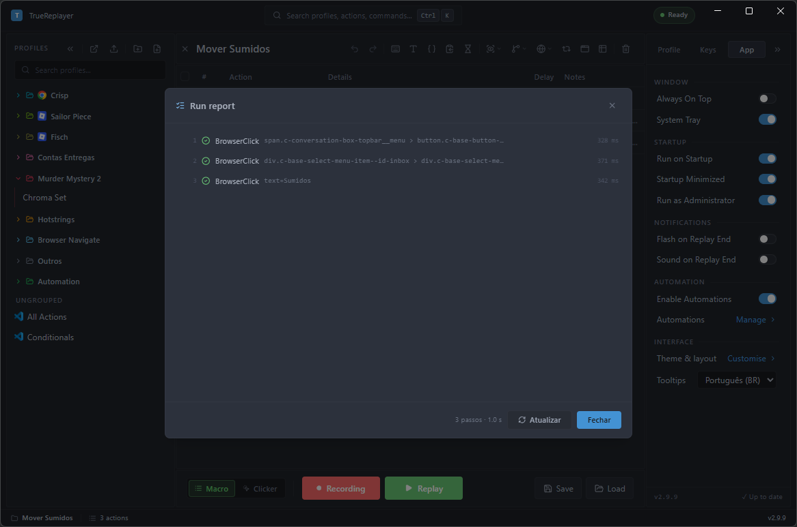<br>
  <sub><i>Every step with what it targeted and how long it took. Here they all passed — when one fails the row turns red and carries the reason, and when one matches through a fallback selector a warning appears at the top.</i></sub>
</p>

> **Last run only.** The report is not a history: each run replaces the previous one, and closing
> the app discards it. It exists for the run you just watched fail. For a record that sticks around,
> the session log is still the place (tray → **Open Logs Folder**).

---

## Themes & appearance

Open the **Theme Editor** from Settings → App → Interface → *Customise*.

<!-- PICT: theme.png — The Theme Editor open on the GALLERY (preset grid, with the search), with the live preview. -->
<p align="center">
  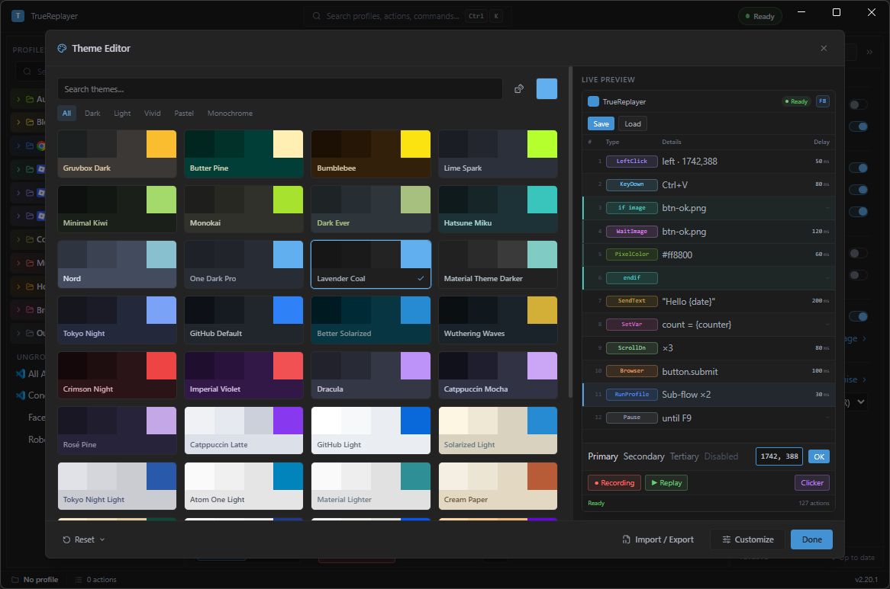<br>
  <sub><i>40+ presets, with a live preview that updates as you edit.</i></sub>
</p>

The editor has three surfaces: it opens on the **gallery**; the **Customise** button opens customization (split into **Colors** and **Interface**); and **Import / Export** opens the sharing screen.

- **Gallery** — 40+ curated presets grouped by hue, with search; click to apply. The default is *Lavender Coal* (dark).
- **Customise → Colors** — 29 colors in 6 groups (Accent, Backgrounds, Text, Borders, Semantic and **Action types** — the pill color of each action type), via picker, hex or HSL; a contrast checker flags low-contrast text.
- **Customise → Interface** — **Density** presets; fine-tune **Font Size**, **Border Radius**, **Row Height**, **Zoom**; the **Monospace** font; **Match Windows theme** (switches dark/light along with Windows, with *Dark preset* / *Light preset*); and **Enable animations** (turn transitions off for accessibility / modest hardware).
- **Import / Export** — share a theme as JSON.

<!-- PICT: theme-interface.png — The Theme Editor's Customise screen with the INTERFACE segment active, showing the Density presets, the fine-tune sliders (Font Size / Border Radius / Row Height / Zoom), the Monospace font, and the System group (Match Windows theme + Enable animations). theme.png shows only the preset gallery. -->
<p align="center">
  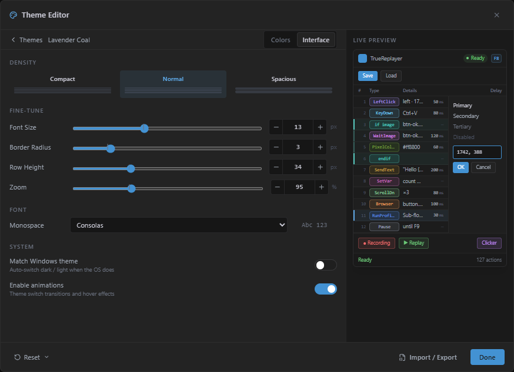<br>
  <sub><i>The <b>Interface</b> tab: density, font size, corners, row height, zoom and the automatic switch with Windows.</i></sub>
</p>

---

## Settings reference

The Settings panel (right side) has three tabs; everything **auto-saves** (no Save button). Collapse it to a slim icon rail to reclaim space. (The panel is shown on the right in the [overview](#the-action-grid).)

**Profile tab** (per profile / mode):
- **Execution** — Delay, Loops, Interval, Jitter (Macro mode).
- **Game Mode** — Smooth movement + Fast approach (and their knobs).
- **Recording** — **Mouse Clicks**, **Mouse Scroll**, **Keyboard**, **Combined Actions**, the **Profile Keys** master switch and **Browser Actions** (record Chrome CSS selectors instead of coordinates).
- **Clicker** — replaces Execution/Game Mode/Recording while in Clicker mode.

**Keys tab** (everything that intercepts a key):
- **Hotkeys** — Recording, Replay, Profile Keys, Foreground, Mode, [Capture Slot](#variables-slots--prompts). Defaults: Record `Ctrl+PageUp`, Replay `Ctrl+PageDown`, Profile-keys `Pause`, Foreground `Insert`, Mode `ScrollLock`, Capture Slot `Win+Ctrl+C` (clear the field to disable it).
- **Clicker** — the Clicker Start/Pause hotkeys (`PageDown` / `PageUp`); they only fire in Clicker mode.
- **Key Remaps** — the always-on remap layer (master switch + the remap list; see [Key Remaps](#key-remaps)).

**App tab** (app-wide):
- **Window** — Always On Top, System Tray.
- **Startup** — Run on Startup, Startup Minimized, Run as Administrator.
- **Notifications** — flash / sound when a replay ends while the window is in the background.
- **Automation** — the Automations master switch + the panel opener.
- **Interface** — opens the Theme Editor; tooltip language: **Português (BR)** or English (names and menus stay in English; only tooltips localize).
- The tab's **footer** shows the running version and a manual **Check for Updates** (it also auto-checks on launch).

---

## Where your data lives

- **Profiles:** `Documents\TrueReplayer\Profiles\*.json`
- **Where each list stopped:** `Documents\TrueReplayer\run-cursors.json` — the **Data Loop** row cursor and the **Set Variable** *Cycle* position, so they pick up where they left off after you close the app. Deleting the file with the app closed just restarts every list from the top.
- **App settings:** `appsettings.json` under the app's local data.
- **Reference images, themes, WebView2 data:** `%LocalAppData%\TrueReplayer\…` — pinned here so it **survives auto-updates**.

---

## Troubleshooting

**A hotkey / replay doesn't fire.**
Check: the profile's **window target** matches the foreground app; the **Profile Keys** master switch (`Pause`) is on; the profile isn't **disabled**; and (for elevated target apps) that TrueReplayer runs **as administrator** (Settings → App → Startup).

**Clicks land in the wrong place after the window moved.**
Enable a **window target** + **relative coordinates** for that profile, then **Convert to Relative**.

**Clicks fire twice.**
**Focus-click** is enabled on those rows (a focus icon shows on the pill). Turn it off unless the target is a small text field that needs it; never use it on buttons.

**A game ignores the clicks.**
Keep **Game mode** on (smooth movement). If a specific game still misclicks, try turning **Fast approach** off, or lowering **Path step** px.

**My automation never fires.**
Saving an automation doesn't start it — flip its **Armed** toggle in the list. Also check the **Enable Automations** master switch, and remember a fire is skipped while a replay is running, a dialog is open, or the grid has unsaved edits.

**A sub-profile ignores its own Loops.**
That's by design: only the **Repeat** count in the *Run Profile* dialog applies. Put the repetition in the parent, or use a data table.

**A recorded step went to the wrong place.**
Recording inserts **before the first selected row**. Click empty space to clear the selection if you meant to append to the end.

**A token typed nothing.**
It resolved to empty — a `{row:column}` whose column doesn't exist, or a `{var:}` that was never set, both resolve to empty text rather than erroring. Press **`Ctrl+K`** → **Toggle Live Variables** and run it again to see what's actually set. If the token is `{clipboard:next}`, the list has most likely **run out**: it doesn't wrap around on its own. Copy the list again (or a different one) and it restarts at line 1.

**The macro stopped by itself with a red `Assert failed` message.**
It did what you told it to: an **Assert** row required something that wasn't true. The quoted name is that row's **Notes** text, and the rest says what went wrong. If the assumption is merely *slow* (the window takes a moment longer to appear), raise that row's **Wait for condition** rather than removing the Assert. See [Assert](#assert--require-something-to-be-true).

**It carried on from somewhere it shouldn't have — the list didn't start over.**
That's deliberate: the **Data Loop** row cursor and the **Set Variable** *Cycle* position are saved to disk and survive closing the app. Right-click the row → **Reset row position** / **Reset cycle position**.

**The UI doesn't load.**
Install the [WebView2 Runtime](https://developer.microsoft.com/microsoft-edge/webview2/) — the app prompts for it on first run if it's missing.

---

<div align="center">

[← Back to README](../README.en.md) &nbsp;·&nbsp; [Português (BR)](GUIDE.md)

</div>
