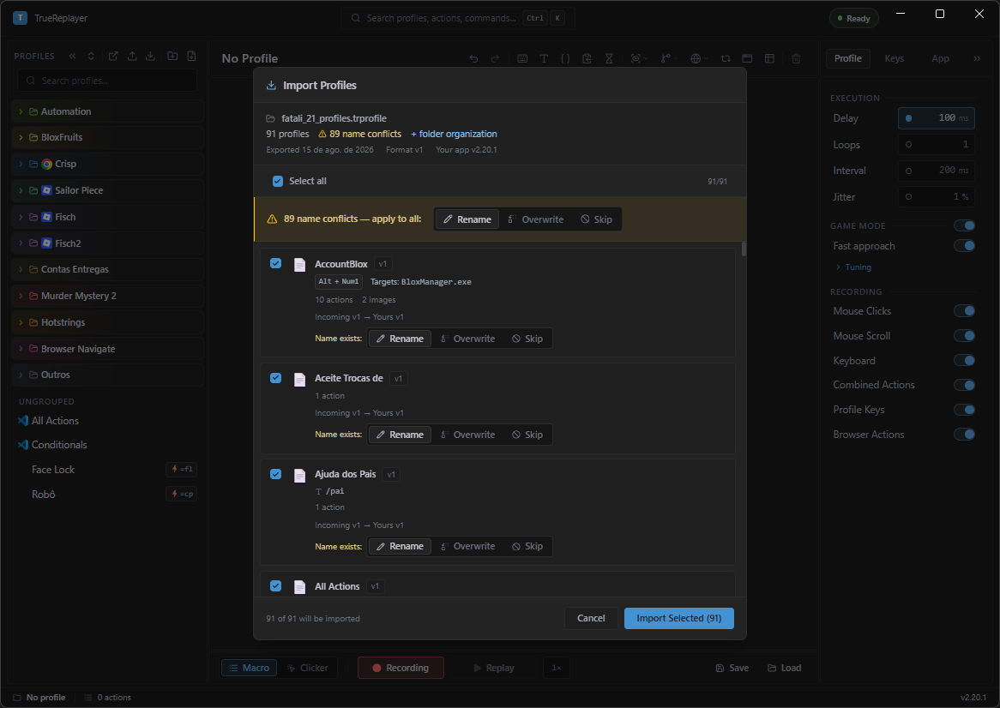
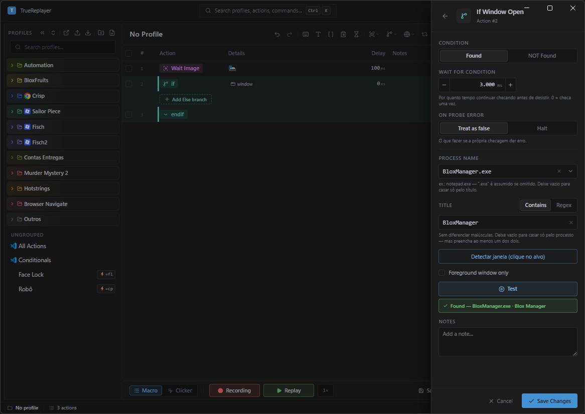
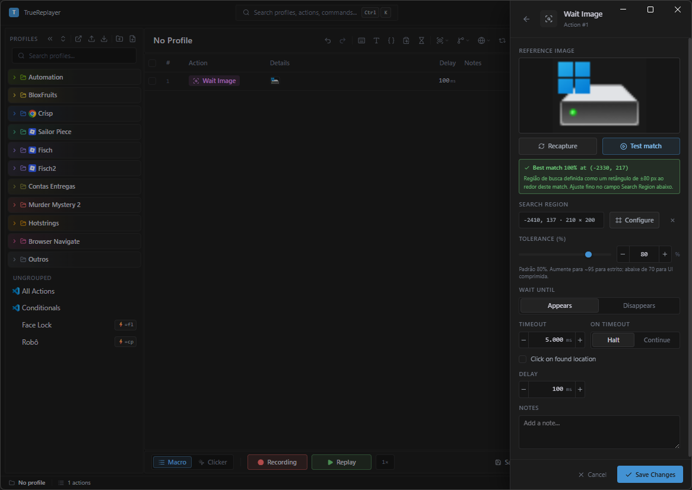

<div align="center">

# TrueReplayer — Manual do Usuário

[← Voltar ao README](../README.md)

</div>

Tudo o que o app faz, do primeiro clique gravado à automação que roda sozinha. Cada parte começa fácil e aprofunda — leia em ordem ou pule direto para o que precisa.

## Conteúdo

| | | |
| --- | --- | --- |
| [1 · Comece aqui](#parte-1--comece-aqui) | [6 · Condicionais & Assert](#parte-6--condicionais--assert) | [11 · Navegador](#parte-11--navegador) |
| [2 · A grade de ações](#parte-2--a-grade-de-ações) | [7 · Esperar a tela](#parte-7--esperar-a-tela) | [12 · Data Loop](#parte-12--data-loop) |
| [3 · Perfis e disparos](#parte-3--perfis-e-disparos) | [8 · Janelas](#parte-8--janelas) | [13 · Aparência e dados](#parte-13--aparência-e-dados) |
| [4 · Send Text & Tokens](#parte-4--send-text--tokens) | [9 · Automação](#parte-9--automação) | [14 · Receitas completas](#parte-14--receitas-completas) |
| [5 · Variáveis, slots e prompts](#parte-5--variáveis-slots-e-prompts) | [10 · Clicker & Game Mode](#parte-10--clicker--game-mode) | [15 · Solução de problemas](#parte-15--solução-de-problemas) |

---

## Parte 1 — Comece aqui

O TrueReplayer grava o que você faz — cliques, teclas, texto — e repete quando você mandar. Quatro palavras resolvem quase todo o vocabulário:

| Termo | O que é |
| --- | --- |
| **Perfil** | Uma macro: a lista de ações + suas configurações. Um arquivo `.json`. |
| **Ação** | Um passo (um clique, uma tecla, um If…). Uma linha na grade. |
| **Pasta** | Grupo colorido de perfis. Um perfil fica em no máximo uma. |
| **Macro / Clicker** | Dois modos: *Macro* grava e reproduz listas de ações; *Clicker* é auto-clicker. Alterne com **`ScrollLock`**. |

O ciclo é **gravar → editar na grade → reproduzir** — e voltar. Você raramente grava perfeito de primeira, e não precisa: afinar na grade é mais rápido que regravar.

> 💡 **A maioria das macros úteis tem uma ou duas ações.** Um Send Text com a resposta pronta. Um clique que se repete. As macros que você vai usar vinte vezes por dia são as curtas.

### Gravando

1. Tenha um perfil ativo (**New** no painel Profiles).
2. **`Ctrl+PageUp`** (ou o botão **Recording**) começa a gravar.
3. Faça as ações normalmente.
4. **`Ctrl+PageUp`** de novo para parar.

**Onde os passos entram:** com linhas *selecionadas*, a gravação insere **antes** da primeira; *sem seleção*, acrescenta no **fim**. (Se um passo gravado "foi parar no lugar errado", quase sempre é isso.)

**Filtros de captura** (Settings → Profile → Recording, tudo ligado por padrão): **Mouse Clicks** · **Mouse Scroll** · **Keyboard** · **Combined Actions** — ligado, `Ctrl+C` vira uma linha só; desligado, linhas KeyDown/KeyUp separadas, necessário para gravar arrastar ou segurar tecla.

### Reproduzindo

**`Ctrl+PageDown`** (ou **Replay**) executa; o mesmo atalho (ou **Stop**) interrompe na hora, soltando qualquer tecla que a macro estivesse segurando.

A reprodução agenda cada ação contra um **prazo**, não empilha esperas: se algo atrasar, ela ressincroniza em vez de disparar uma rajada acumulada. Depois de ações que esperam por natureza (Wait Image, Pause, Run Profile, ações de navegador, If com espera), o relógio também ressincroniza — um delay colocado como acomodação nunca é comprimido.

| Configuração | O que faz | Padrão |
| --- | --- | --- |
| **Delay** | Atraso fixo antes de cada ação, contado do **início** da anterior (ação de 30 ms + delay 100 ms → a próxima começa em 100 ms, não 130). | 100 ms |
| **Loops** | Repetições da macro inteira, 1 a 999. **Pertence ao perfil** e viaja no export. | 1 |
| **Interval** | Pausa entre uma repetição e a seguinte. Também é do perfil. | desligado |
| **Jitter** | Variação aleatória de ± % em cada delay. | desligado |

> ⚠️ **Não existe "0 = infinito".** O mínimo de Loops é 1. Para rodar até você mandar parar, use os modos de disparo **While Pressed** ou **Toggle** (Parte 3).

A pílula de loop mostra o que a **próxima execução** fará: `3×`, `por linha` (Data Loop) ou `∞`. Contorno tracejado âmbar = você mexeu e não salvou.

---

## Parte 2 — A grade de ações

Colunas: **caixa · Action · Details · Delay · Notes**. Cada linha é uma ação; a caixa desmarcada *pula* a linha sem apagá-la.

<p align="center">
  <br>
  <sub><i>Perfis à esquerda, grade no centro, configurações à direita.</i></sub>
</p>

| Tarefa | Como |
| --- | --- |
| **Selecionar** | Clique · `Ctrl+Click` alterna · `Shift+Click` estende. |
| **Editar na linha** | Clique na célula: Delay, Notes, coordenadas, Key. `Enter` confirma, `Esc` cancela. |
| **Reordenar** | Arraste, ou **`Alt+↑` / `Alt+↓`**. |
| **Pular** | Desmarque a caixa — fica na lista, não roda. |
| **Em massa** | Com várias selecionadas: Set delay, Set X/Y, Set notes, Move, Skip, Delete. |
| **Formulário completo** | Botão direito → **Edit**. |

**O menu da linha** (botão direito): **Edit · Pick from screen · Duplicate · More · Delete**.

- **Pick from screen** *(linhas de clique, incluindo Double Click)* — abre o seletor de posição na tela; ao escolher o ponto, o formulário abre com X/Y já preenchidos como rascunho. **Save** grava, **Cancel** descarta — nada muda até você salvar.
- **More** guarda o resto, começando por **Copy Coordinates**.

### Referência de ações

| Ação | O que faz |
| --- | --- |
| **Left / Right / Middle Click** | Um clique em (x, y) — ou N cliques com intervalo, Gap jitter e Position jitter. |
| **Double Click** | Dois cliques abaixo do limiar do sistema, para o app ler como duplo real. Aceita × N. |
| **Keystroke** | Uma tecla ou combinação — ou N vezes com intervalo e Gap jitter. |
| **Hold Key** | Segura uma tecla por N ms (padrão 1000). Modificadores são descartados. |
| **Key Down / Key Up** | Pressionar ou soltar isolado — para arrastar ou segurar tecla. |
| **Scroll Up / Down** | Um passo da roda na posição do cursor. |
| **Send Text** | Injeta texto com tokens — Parte 4. |
| **Set Variable** | Guarda um valor, lido com `{var:nome}` — Parte 5. |
| **Copy to Slot** | Copia a seleção atual para um slot, lido com `{clip:nome}` — Parte 5. |
| **Pause** | Para até uma hotkey de retomada ou um timeout — Parte 7. |
| **Wait Image / Wait Pixel Color** | Esperam a tela ficar pronta — Parte 7. |
| **Run Profile** | Executa outro perfil como subpasso. Ciclos e mais de 5 níveis são bloqueados. |
| **Activate Window** | Activate / Maximize / Minimize / Close noutra janela — Parte 8. |
| **If / Else / EndIf · Assert** | Blocos condicionais e exigências — Parte 6. |
| **Browser actions** | Click / Type / Navigate / Wait / Assert / Select no Chrome — Parte 11. |

### Repetição em cliques e teclas

Keystroke e os cliques repetem na própria linha: **Times to repeat** (1 a 999) · **Gap between** (padrão 30 ms; **600 ms** no Double Click, porque um duplo precisa de folga acima da velocidade do Windows para contar como duplo *distinto*) · **Gap jitter** (± % aleatório) · **Position jitter** *(só cliques)* — espalha o ponto em ± N px por eixo.

<p align="center">
  <br>
  <sub><i>Numa <b>tecla</b>: Times, Gap e Gap jitter.</i></sub>
</p>

<p align="center">
  <br>
  <sub><i>Num <b>clique</b>: os mesmos três, mais o <b>Position jitter</b>.</i></sub>
</p>

> 🎲 **Quando usar jitter.** `Click × 3` com Gap + Position jitter parece humano — é o que serve em jogos, onde repetir o mesmo pixel no mesmo ritmo é o sinal mais óbvio de macro. Para automação comum (um botão, um campo), **deixe desligado**: ali você quer o pixel exato.

---

## Parte 3 — Perfis e disparos

### Perfis e pastas

- **New / Save / Rename / Duplicate / Delete** no painel Profiles. **Pin** mantém no topo.
- **Pastas** — arraste um perfil para dentro; cor, renomear, recolher. Uma pasta pode ter um **alvo de janela** que os perfis herdam (Parte 8).
- **Info** (botão direito) — emoji, descrição e **tags** pesquisáveis.
- **Import / Export** — arquivo `.trprofile` com ações, metadados, imagens e layout.

<p align="center">
  <br>
  <sub><i>Nada é sobrescrito em silêncio: cada conflito recebe Rename (padrão), Overwrite ou Skip.</i></sub>
</p>

Um perfil que exige um TrueReplayer mais novo que o seu aparece esmaecido na importação, com o motivo.

### Hotkeys e hotstrings

- **Hotkey** — botão direito no perfil → **Assign hotkey** → pressione a combinação. Dispara em qualquer app.
- **Hotstring** — uma sequência digitada (ex.: `.cp`) que roda o perfil ao terminar de ser escrita.
- **Chave-mestra** — `Pause` liga/desliga todas de uma vez.
- **Botões laterais do mouse** (XButton1/2) valem como teclas, com todos os modos. A roda também, sempre em On Press.

<p align="center">
  <br>
  <sub><i>Capture a combinação e escolha o modo.</i></sub>
</p>

| Modo | Comportamento |
| --- | --- |
| **On Press** | Uma vez, ao pressionar. |
| **On Release** | Uma vez, ao soltar. |
| **While Pressed** | Repete enquanto segurada; para ao soltar. |
| **Toggle** | Primeiro toque inicia, segundo para. |
| **Double-tap** | Dois toques rápidos (~0,4 s). Toque único não faz nada. |
| **Hold** | Uma vez após segurar ~0,6 s. Não para ao soltar. |

Os modos valem só para hotkeys — hotstrings sempre disparam ao serem digitadas.

### Remaps de tecla

Settings → Keys → **Key Remaps**: camada 1:1 sempre ativa, independente de perfis. `CapsLock → Esc` vale no sistema inteiro enquanto o app roda; mapear para nada desativa a tecla. Remaps pausam durante a gravação, e uma tecla usada como origem não pode ser hotkey de perfil — o remap vence.

### A paleta de comandos — `Ctrl+K`

O que não tem botão próprio mora aqui: **Copy as Table / Paste Actions** (mover passos entre perfis), **Convert to Relative / Absolute**, **Toggle Live Variables**, **Run report**, Import/Export all, Theme Editor.

---

## Parte 4 — Send Text & Tokens

A ação **Send Text** injeta texto por colagem — layouts e acentos sobrevivem. E dentro do texto entram **tokens**: palavras entre chaves, como `{date}` ou `{clipboard}`, trocadas pelo valor real **no momento da execução**. Escreva `Olá! Hoje é {date}.` e rode amanhã: a data será a de amanhã.

<p align="center">
  <br>
  <sub><i>Chips clicáveis nas seções Clipboard · Values · Keys &amp; timing · Run state — você não decora sintaxe.</i></sub>
</p>

Confirme com **`Ctrl+Enter`** — o `Enter` sozinho só pula linha.

### Nível 1 — Tokens prontos para usar

| Token | Vira | Exemplo de saída |
| --- | --- | --- |
| `{date}` | Data de hoje | `21/08/2026` |
| `{time}` | Hora atual | `14:35:07` |
| `{datetime}` | Data e hora | `21/08/2026 - 14:35:07` |
| `{random:1-10}` | Número aleatório entre 1 e 10 (incluindo as pontas) | `7` |

Cada `{random:a-b}` sorteia por conta própria: `{random:1-6} {random:1-6}` são dois dados.

**Teclas e pausas no meio do texto** — alguns tokens viram *tecla pressionada*: `{enter}` `{tab}` `{space}` `{backspace}` `{delete}` `{escape}` `{home}` `{end}` `{pageup}` `{pagedown}` `{up}` `{down}` `{left}` `{right}`. Repita com contagem — `{enter:3}` pressiona Enter 3 vezes — e pause com `{delay:500}` (500 ms) quando o site demora para reagir.

**O mais usado: `{clipboard}`** — vira o que estiver copiado (Ctrl+C) no momento da execução. Copie o nome do cliente, aperte o atalho: `Localizei o pedido {clipboard}, um momento!`. Seu clipboard real é restaurado depois. E se o texto copiado contiver `{enter}` escrito, ele é digitado como texto — conteúdo colado nunca "vira tecla" sem querer.

**Formatação — o seletor Delivery** (no rodapé do editor): **Rich** (padrão — e-mail, documentos) · **Markdown** (WhatsApp: `*negrito*`) · **Discord** (`**negrito**`) · **Plain** (busca, chat de jogo, código).

> ✳️ **A mensagem chegou mostrando asteriscos?** Você mandou Markdown para um app que não entende — troque para Rich ou Plain. Se a formatação *sumiu*, o alvo não aceita texto rico.
>
> **Snippet ≠ ação.** Snippets são textos reutilizáveis salvos por nome, para *você escrever* mais rápido — ficam no app, não no perfil, e não viajam no export. O que roda é a ação Send Text salva na grade.

### Nível 2 — Modificadores: transformando o texto

Depois do nome do token, encaixe **modificadores** separados por dois-pontos. Cada um transforma o resultado do anterior, como uma linha de montagem — **a ordem importa**. Valem para `{clipboard}`, `{clip:nome}`, `{var:nome}`, `{winclip:N}`, `{row:coluna}` e `{rownext:coluna}`.

```
{clipboard:trim:upper}   sobre "  maria souza "
  trim   →  "maria souza"      (espaços das pontas removidos)
  upper  →  "MARIA SOUZA"      (tudo maiúsculo)
```

**Caixa e limpeza** — `upper` · `lower` · `title` (Primeira De Cada Palavra) · `sentence` (primeira da frase) · `trim`.

**Pegando pedaços** — partindo de um cadastro de 3 linhas (`Maria Souza` / `maria@email.com` / `(11) 98888-7777`):

| Modificador | O que faz | Exemplo |
| --- | --- | --- |
| `line:N` | Só a linha N | `{clipboard:line:2}` → `maria@email.com` |
| `word:N` | Só a palavra N | `{clipboard:word:1}` → `Maria` |
| `words:a-b` | Da palavra *a* até a *b* (mantém o espaçamento original) | `words:1-2` → `Maria Souza` |
| `first:N` / `last:N` | Primeiros / últimos N **caracteres** | `{clipboard:line:3:last:4}` → `7777` |
| `range:a-b` | Da linha *a* até a *b* | `range:1-2` → as 2 primeiras linhas |
| `lines:i,j,k` | Escolhe e reordena linhas | `lines:3,1` → telefone, depois nome |

Em `words` e `range` as pontas podem ficar abertas: `words:6-` é "da 6ª em diante"; `range:-5` é "até a linha 5". E pedir algo que não existe (`line:99` num texto de 3 linhas) dá **vazio** — nunca o texto inteiro por engano.

**Cortando por um marcador** — quando o texto tem um separador fixo:

```
"Nome do Produto - Caixa de Sapato Rara"
  {clipboard:before: - }  →  Nome do Produto
  {clipboard:after: - }   →  Caixa de Sapato Rara
```

`before:X` / `after:X` cortam na **primeira** ocorrência; `beforelast:X` / `afterlast:X` na **última** (`{clipboard:afterlast:/}` num caminho devolve o nome do arquivo). O marcador é descartado; a comparação ignora maiúsculas.

> ⚠️ **Espaços contam — a armadilha nº 1 dos cortes.** `after:-` e `after: - ` são cortes *diferentes*: cortando `Produto - 1x Caixa` só no `-`, o resultado começa com espaço. Quase sempre você quer o marcador **com os espaços em volta**. E se o marcador **não existir** no texto, o resultado é **vazio** — de propósito, para a macro nunca colar um clipboard inteiro onde você esperava um pedacinho.

**Cortar num dois-pontos** — o `:` separa a cadeia, então como marcador ele é gravado **em dobro** (`::`). No campo **Cortar em** do construtor você digita ` : ` normalmente; montando à mão:

| Você quer cortar em | Escreva |
| --- | --- |
| `:` | `{clipboard:after:::}` |
| ` : ` | `{clipboard:after: :: }` |
| `R$:` | `{clipboard:after:R$::}` |

Vale para os quatro cortes e para `dropnum`. **Exceção: o `join`** — ali o dobrado já significa "juntar sem separador nenhum", então o campo Juntar com continua removendo o `:`. Um perfil que use `::` exige a 2.23.0 para importar; `dropnum`, a 2.24.0.

**Removendo quantidade do começo: `dropnum`** — texto que vem "às vezes com, às vezes sem" um contador na frente:

```
{clipboard:after: - :dropnum:x }
  "Nome do Produto - 1x Caixa de Sapato"  →  Caixa de Sapato
  "Nome do Produto - Caixa de Sapato"     →  Caixa de Sapato   (sem o "1x", nada muda)
```

Se o texto começa com números seguidos do sufixo, remove os dois; senão, **não mexe em nada**. Repare no sufixo `x ` — "x" *seguido de espaço*: sem ele sobraria ` Caixa de Sapato` começando em espaço. E o corte anterior precisa ser `after: - ` (com espaços), senão o texto chega ao dropnum começando com espaço e ele — corretamente — não remove nada.

**Trabalhando com listas** (várias linhas):

```
{clipboard:sort:dedupe:join:, }   sobre  banana / maçã / banana / abacaxi
  sort    →  abacaxi / banana / banana / maçã
  dedupe  →  abacaxi / banana / maçã
  join:,  →  abacaxi, banana, maçã
```

`sort` (A→Z, ignora maiúsculas) · `dedupe` (remove repetidas, mantém a primeira) · `reverse` (inverte a ordem) · `join:X` (junta tudo numa linha; `join:` sem nada = coladas).

<p align="center">
  <br>
  <sub><i>O chip <b>Advanced…</b> (ou clicar em qualquer chip) abre o construtor: etapas numeradas + prévia ao vivo com o conteúdo real.</i></sub>
</p>

> 🛠️ As etapas aplicam numa ordem fixa, e o construtor monta o token sozinho — você marca as opções e vê o resultado na hora. Modificador que o app não conhece é ignorado: um erro de digitação não quebra a macro.

---

## Parte 5 — Variáveis, slots e prompts

Três ferramentas para valores que mudam, cada uma com uma duração:

| Ferramenta | Quanto dura | Como ler |
| --- | --- | --- |
| **Set Variable** | Até o fim da execução atual | `{var:nome}` |
| **Copy to Slot** / hotkey **Capture Slot** | Entre execuções, enquanto o app estiver aberto | `{clip:nome}` ou `{clip:1}`…`{clip:9}` |
| **`{input:Rótulo}`** | A execução atual (pergunta uma vez) | o próprio token |

### Set Variable

Dê um **Name** e um **Value**. O valor é montado *na hora de guardar* — aceita `{clipboard}`, `{row:col}`, `{date}` ou outro `{var:}` — o que congela o momento:

| Linha | Efeito |
| --- | --- |
| Set Variable — `cliente = {clipboard:line:1:trim}` | guarda a 1ª linha copiada |
| Send Text — `Olá {var:cliente}, recebemos seu pedido!` | usa o valor |
| Send Text — `Obrigado, {var:cliente}!` | mesmo valor, mesmo se o clipboard mudou |

- **Nomes:** letras, números e `_` — sem espaço e sem acento. `{var:nome_cliente}` funciona; `{var:Ação}` não resolve.
- Guardar um valor **vazio apaga** a variável. `{var:nome}` aceita modificadores: `{var:cliente:upper}`.
- **Modo Cycle:** o valor vira uma lista (um item por linha) e cada execução guarda o **próximo**, voltando ao início no fim. A posição é **guardada em disco** — fechar o app não recomeça. Zerar: botão direito na linha → **Reset cycle position**.

### Slots: Copy to Slot e a hotkey Capture Slot

Slots são "clipboards extras" com nome, que **sobrevivem entre execuções** — capture agora, use depois.

- **A hotkey** (`Win+Ctrl+C`) — para quando *você* escolhe o que copiar. Selecione um texto e aperte: cai em `{clip:1}`; de novo, `{clip:2}`… até 9, e volta ao 1. Um aviso mostra onde caiu. **Não funciona durante uma execução.**
- **A ação Copy to Slot** — para quando a *macro* acha o valor sempre no mesmo lugar. Modo **Capture** (padrão) copia o que estiver **selecionado** para o slot nomeado — garanta a seleção antes (um `Ctrl+A` na linha anterior, por exemplo). Modo **Clear** esvazia o slot; com o nome em branco, limpa **todos** e devolve a hotkey ao slot 1.

<p align="center">
  <br>
  <sub><i>O modo <b>Clear</b> esvazia um slot — ou todos, se o nome ficar em branco.</i></sub>
</p>

> 📋 **Slot vazio?** As duas formas copiam mandando Ctrl+C para o app em foco, então **o texto precisa estar selecionado**. Se nada for copiado, o slot mantém o valor antigo — uma captura falhada nunca apaga uma boa.

**Exemplo — juntando três informações espalhadas:** nome do cliente, número do pedido e código de entrega, cada um num sistema. Três `Win+Ctrl+C` (→ `{clip:1}`, `{clip:2}`, `{clip:3}`) e um Send Text entrega tudo: `Olá {clip:1}, seu pedido {clip:2} foi enviado! Código: {clip:3}{enter}`. Recolher são três toques, enviar é um só.

### Perguntar na hora: `{input:Rótulo}`

Quando a macro chega num `{input:...}`, ela **pausa e abre uma janelinha**. O app se traz para a frente sozinho e, depois da resposta, **devolve o foco** para a janela de antes — o texto cai no app certo.

<p align="center">
  <br>
  <sub><i>Com <code>|menu:…</code> ela vira uma lista para clicar.</i></sub>
</p>

- `{input:Número do pedido}` — campo livre (o rótulo pode ter espaços).
- `{input:Prioridade|menu:Baixa,Média,Alta}` — em vez de digitar, você **escolhe numa lista**.
- Pergunta **uma vez por rótulo, por execução** — e a resposta vira variável: `{var:prioridade}` reutiliza depois.
- `Esc`/**Cancel** param a macro. Sem resposta em 60 s, a execução aborta — uma automação sem ninguém olhando não fica travada.

### Outras fontes de texto

| Token | De onde vem |
| --- | --- |
| `{winclip:1}` | O **histórico do Windows** (Win+V): 1 = a última coisa copiada, 2 = a anterior… Precisa do histórico ativado no Windows. |
| `{clipboard:next}` | Auto-avança: cada uso cola a **próxima linha** do clipboard. Em branco são puladas; no fim vira vazio (não volta ao começo); copiar outra coisa recomeça sozinho. Combina: `{clipboard:next:trim:upper}`. |
| `{counter}` | A volta atual do loop (1, 2, 3…). |
| `{row:coluna}` / `{rownext:coluna}` | A tabela do Data Loop — Parte 12. |
| `{row}` | O número da linha **da ação na grade** — não é a tabela. |

> 🔍 **Regra de ouro: token sem valor vira texto vazio, nunca erro.** Se algo saiu em branco: `Ctrl+K` → **Toggle Live Variables** e rode de novo — o painel mostra variáveis, slots e a linha atual, ao vivo.

<p align="center">
  <br>
  <sub><i>Variáveis, slots e a linha atual, ao vivo.</i></sub>
</p>

**Truques de quem já domina:**

- **Número vindo de variável:** onde a transformação pede um número, escreva `@` e o nome — `{clipboard:line:@i}` pega a linha indicada pela variável `i`. Reservados: `@counter` (num loop, `{clipboard:line:@counter}` pega a linha 1 na primeira volta, a 2 na segunda…) e `@row` (a linha do Data Loop). Vale em Line #, Word #, First N e Last N; no construtor, o botãozinho **@** alterna entre número fixo e variável.
- **Nome que não existe sai vazio**, de propósito — o contrário colaria o clipboard inteiro por causa de um erro de digitação.
- `{clipboard:line:{var:i}}` com chaves **não funciona** e nunca funcionou — a grafia com `@` existe justamente por isso.

---

## Parte 6 — Condicionais & Assert

Um **condicional** divide a macro em dois caminhos: *se* algo é verdade, executa um bloco; *senão*, executa outro (ou pula direto). Na grade, são três linhas: **If** (a pergunta), **Else** (opcional) e **EndIf**. Só um dos dois blocos roda em cada execução.

<p align="center">
  <br>
  <sub><i>Cada nível de aninhamento ganha a sua cor.</i></sub>
</p>

### Seu primeiro If

Barra → botão **Conditional** (ícone de ramificação) → **Insert Conditional** → escolha o tipo. *Image Found* e *Pixel Color Match* abrem a captura para marcar a imagem ou o pixel; os outros inserem o par If/EndIf direto. O bloco entra **antes** da linha selecionada.

| Linha | Quando roda |
| --- | --- |
| **If** — Image Found · `botao_fechar.png` | sempre — é a checagem |
| Left Click no X do pop-up | só se a imagem apareceu |
| **EndIf** | fecha o bloco |

- **Para editar a linha If:** passe o mouse e clique no lápis, ou selecione e aperte `Enter`. O editor tem o botão **Test** — ele faz a mesma pergunta que a execução faria e responde na hora. Use sempre: evita descobrir o erro só na execução.
- **Para ganhar um Else:** dentro do bloco, logo acima do EndIf, existe a linha tracejada **+ Add Else branch**. É ali que o Else nasce — não está no menu do botão direito.

<p align="center">
  <br>
  <sub><i><b>Condition</b>, <b>Wait for condition</b>, <b>On Probe Error</b> — e o <b>Test</b>, que confere agora sem rodar a macro.</i></sub>
</p>

> ⚠️ **Confiança de imagem: nunca use 100%.** Uma tela viva nunca fica idêntica pixel a pixel — em 100% a macro nunca acha. Fique na faixa de 80–90% (o padrão é 80%).

### As 10 condições

| Condição | Verdadeiro quando | Exemplo |
| --- | --- | --- |
| **Image Found** | Uma imagem está visível na tela | o ícone de "salvo" apareceu? |
| **Pixel Color Match** | O pixel em (x, y) bate com uma cor | o botão liga/desliga está verde? então pule o clique |
| **Window Open** | Existe janela com aquele processo/título | o Bloco de Notas está aberto? |
| **Clipboard** | O texto copiado casa (Contains / Equals / Regex) | regex `^\d{11}$` — o que copiei é um CPF? |
| **Browser Element** | Um elemento no Chrome está presente / visível / habilitado | o botão Enviar saiu do cinza? |
| **Random** | Um sorteio cai abaixo de N% | 30% das vezes, pausa extra — a macro deixa de parecer um metrônomo |
| **Variable** | `{var:nome}` compara verdadeiro | tentativas > 3? vá para o plano B |
| **Process Running** | Um processo está rodando | chrome.exe está aberto? |
| **File Exists** | Um arquivo ou pasta existe (o caminho aceita tokens) | o download de hoje já terminou? |
| **Time** | O relógio está na janela início–fim, nos dias escolhidos (22:00–02:00 funciona) | é horário comercial? |

Nas condições de **estado** (Clipboard, Variable, Random, Time) as opções aparecem como *Met / NOT Met*; nas de **objeto**, como *Found / NOT Found*. Mesma ideia.

### A dupla Set Variable + If Variable

Uma ação **guarda** um estado, o If **decide** por ele. Operadores: **igual** e **diferente** (ignoram maiúsculas), **contém**, **maior** e **menor** — estes dois comparam como *número* quando os dois lados são números; senão, ordem alfabética. O campo de comparação **aceita tokens** (`{clipboard}`, `{date}`, outra `{var:}`); variável nunca definida conta como vazio.

| Linha | Efeito |
| --- | --- |
| Set Variable — `motivo = {input:Motivo\|menu:Troca,Devolução}` | pergunta e guarda |
| **If** — Variable · motivo = `Troca` | decide a rota |
| Send Text — fluxo de troca… | ramo "sim" |
| **Else** / Send Text — fluxo de devolução… / **EndIf** | ramo "não" |

### Ferramentas finas do If

- **Negate** — inverte: "If *NOT* Image Found" = "se a imagem *não* está na tela".
- **Wait for condition** (ms) — por padrão o If verifica **uma única vez**; com um tempo aqui, ele fica reverificando até valer ou o tempo estourar ("espere aparecer, mas não para sempre"). Satisfez → ramo sim, *na hora* — ele não espera a janela inteira; estourou → ramo não.
- **On Probe Error** — se a *própria checagem* falhar (janela de referência sumiu), **Treat as false** (padrão) segue pelo Else; **Halt** para a execução.
- **Dois tempos que não se confundem:** o **Delay** da linha If é espera fixa *antes* da checagem — gasta tudo mesmo que já estivesse pronto. O **Wait for condition** gasta *só o necessário*. Preenchendo os dois, somam.

### Aninhando — e a escada que substitui o "Else If"

Blocos dentro de blocos, **sem limite de profundidade**. Para criar: **selecione uma linha dentro do bloco** → Insert Conditional.

> 🪜 **Não existe "Else If" — e não faz falta.** Para testar várias opções em sequência, monte uma **escada**: cada novo If entra *dentro do Else* do anterior. Troca → senão: Devolução → senão: encaminha ao atendente.

> ⚠️ **Aninhar nem sempre é o certo.** Dois blocos **irmãos** (um depois do outro) verificam as duas coisas *sempre*. Um bloco **dentro** do outro só verifica a segunda quando a primeira valeu. Se o segundo If é um caminho de *recuperação* ("não achou a tela? volta para a busca"), ele precisa ficar como irmão — aninhado, nunca rodaria justamente quando é necessário.

**Editando o conteúdo de um bloco:** uma operação só pega o bloco inteiro quando a seleção inclui um marcador (If / Else / EndIf) — marcadores nunca ficam órfãos. Arraste ações do corpo para dentro/fora livremente; `Alt+↑/↓` com seleção só de corpo move sozinha, tocando um marcador leva o bloco; Delete no corpo mantém o bloco, no **If** apaga o bloco inteiro; duplicar um If copia o bloco inteiro.

### Assert — exigir que algo seja verdade

Um If *pergunta* e segue por um dos dois caminhos. Um **Assert** *exige*: se não for verdade, **para na hora e diz qual premissa falhou**. Uma linha só, sem ramificação — barra → ícone de ramificação → **Insert Assert**.

> 🧭 **Wait, If ou Assert?** **Wait** = *sincronizar* ("espere a tela ficar pronta"). **If** = *ramificar* — os dois caminhos são normais. **Assert** = *exigir* ("daqui não passa sem isto") — só um caminho é aceitável.

São **seis condições** de propósito — Window Open, Process Running, Clipboard, Variable, File Exists e Time. Imagem e pixel já param sozinhos por timeout (Wait Image / Wait Pixel, Parte 7), e para página existe o Assert Element (Parte 11).

**Campos:** Require (Met/NOT Met) · Wait for condition (padrão 1500 ms; Time não aceita — relógio não muda de resposta se você insistir) · On failure (**Abort** padrão, ou Continue, que só registra) · **Notes** — o nome que aparece na falha. Preencha sempre: sem ele a mensagem cai para `'element'`, e com três asserts na macro você não sabe qual parou.

**Exemplo — a macro que digitou a senha na janela errada:** uma macro de login funciona todo dia — até o dia em que o app demora e os cliques (e a **senha**) caem no chat que estava por baixo, sem nenhum erro na tela. O conserto é uma linha antes de digitar:

| Linha | O que acontece |
| --- | --- |
| **Assert** — Window Open · `app.exe` *(foreground)* · wait 3000 · Notes: `janela de login em foco` | espera até 3 s; não apareceu → **para aqui** |
| Send Text `{var:usuario}` / `{clip:senha}` | só rodam com a janela garantida |

A falha vira uma mensagem que se explica: `Assert failed: 'janela de login em foco' — window app.exe was not in the foreground`. Se a premissa for só *demorada*, não troque o Assert por If — aumente o Wait for condition.

---

## Parte 7 — Esperar a tela

Uma pausa fixa de 3 segundos erra dos dois lados: perde tempo quando a tela já estava pronta, e falha no dia em que demorou 4. As ações de espera resolvem os dois problemas.

### Wait Image

Barra → **Wait for Image** → recorte o pedaço da tela que você espera → **Test match**.

<p align="center">
  <br>
  <sub><i>O <b>Test match</b> confere contra a tela agora e já ajusta a região de busca em volta do que achou.</i></sub>
</p>

- **Tolerance** — padrão **80%**. ~95 para estrito; abaixo de 70 para UI comprimida. **Nunca 100%.**
- **Wait until** — *Appears* ou *Disappears* (esperar um "Carregando…" sumir vale tanto quanto esperar um botão surgir).
- **Timeout + On Timeout** — **Halt** para a macro, **Continue** segue.
- **Click on found location** — clica direto no ponto encontrado, poupando uma ação.
- **Search region** — limitar a busca é mais rápido e dá menos falso positivo.

### Wait Pixel Color

Espera o pixel em (x, y) bater com uma cor, com tolerância. Mais leve que imagem — perfeito para indicadores: o LED que fica verde, o botão que sai do cinza.

### Pause

Para até uma **hotkey de retomada** ou um **timeout** — precisa de um dos dois. É a espera *humana*: "faça sua parte e me avise" no meio da macro.

---

## Parte 8 — Janelas

Um clique gravado guarda um ponto **da tela**. Alguém arrasta a janela dez pixels e a macro que ontem acertava passa a errar tudo. O **alvo de janela** prende o perfil a uma janela — e as **coordenadas relativas** medem os cliques a partir do canto *da janela*: ela se move, o clique vai junto. Vale também para regiões do Wait Image e coordenadas do Wait Pixel.

<p align="center">
  <br>
  <sub><i>Processo / título, coordenadas relativas e opções de restauração.</i></sub>
</p>

### O fluxo de 4 passos

1. Botão direito no perfil → **Window target…** → **Detect Window** → clique na janela do app.
2. **Test front window** — tem que dar *✓ Matches*. Título que muda a cada atendimento? Use **Contains** com só o pedaço fixo (ou Regex, se o fixo estiver no começo *e* no fim: `^Pedidos .* — Sistema$`).
3. Ligue **Relative Coordinates**. Se a macro já estava gravada, aparece *N actions captured in absolute coords* — clique em **Apply target & convert**.
4. **Set Target.** Nada é gravado até esse clique.

> ⚠️ **No passo 3, não clique em Skip.** Ele deixa os números antigos e o app passa a lê-los como se já fossem relativos — é aí que a macro começa a clicar no canto errado. Deixe o app converter.

- Com alvo definido, a **hotkey só dispara com aquela janela na frente** (**Bring to Focus** traz a janela antes de rodar e devolve a hotkey a qualquer janela).
- **Restore Position / Size** devolve a janela a uma geometria salva — grave com **Update Window Size & Position** antes de ligar. Relativa faz a macro *seguir* a janela; Restore *devolve* a janela ao lugar. Juntas, segurança em dobro.
- Se o perfil usa coordenadas relativas e a janela não for achada, a execução **para com erro** — em vez de clicar em qualquer lugar.
- Uma **pasta** pode ter alvo próprio, que os perfis dela herdam.

### Activate Window — trocar de app no meio da execução

O alvo de janela prende o perfil inteiro. A ação **Activate Window** é outra coisa: um *passo* que muda qual app está na frente — **Activate / Maximize / Minimize / Close**.

<p align="center">
  <br>
  <sub><i>O verbo <b>Action</b> e os campos de identificação da janela.</i></sub>
</p>

> 🎯 **Ela muda só o foco — nunca o contexto de coordenadas.** Os cliques continuam resolvendo contra o alvo do perfil. Os dois desenhos que funcionam: **multi-janela simples** = perfil *sem* alvo, cliques absolutos, um Activate Window antes dos passos de cada app; **multi-janela de precisão** = um perfil orquestrador sem alvo alternando *Activate Window X → Run Profile "passos-de-X"*, onde cada sub-perfil tem o próprio alvo e coordenadas relativas.

**Campos:** Process e/ou Title (**Match #** escolhe a N-ésima janela) · **Path / Args** abrem o app se nenhuma janela casar · **Placement** posiciona (só visual) · **Timeout / On Timeout** (Halt padrão / Continue) · **Test**.

---

## Parte 9 — Automação

Uma automação dispara um perfil sozinha. Settings → App → **Automation** → **Manage ›** (ou bandeja → Automations…). Cada perfil tem no máximo um gatilho:

| Tipo | Dispara |
| --- | --- |
| **Interval** | A cada N segundos, contando **do último disparo real** — sobrevive a fechar o app. |
| **Schedule** | Num horário `HH:mm`, nos dias escolhidos (nenhum dia aceso = todos). Conta pelo relógio. |
| **Condition** | Quando a condição **fica verdadeira**: janela abre, processo inicia, arquivo aparece, pixel bate, imagem aparece, clipboard muda. |

<p align="center">
  <br>
  <sub><i>Lista com a chave <b>Armed</b> à esquerda, editor do gatilho à direita.</i></sub>
</p>

### Como se comporta

- **Armed é local desta máquina** — perfis importados ou duplicados chegam desarmados. Armadas se re-armam ao iniciar o app.
- **Uma execução por vez** — durante um replay, gravação, diálogo aberto ou grade com edição não salva, o disparo tenta por uma janela curta e depois é **pulado** (e contado). Uma automação nunca atropela trabalho não salvo.
- **Respeita os Loops, nunca roda para sempre** — o infinito de While Pressed / Toggle é ignorado quando quem chama é o gatilho.
- **Schedule perdido é descartado** — a máquina suspensa às 08:00 que acordou às 18:00 não te embosca (perdido por poucos minutos, ainda tenta).
- **Condição só dispara na virada** — precisa voltar a ser falsa antes do próximo (mude para **Continuous** para repetir enquanto verdadeira). Cooldown padrão 30 s.
- **Check every** — o custo do vigia é por checagem. `0` usa o padrão (250 ms pixel, 500 ms clipboard, 1 s o resto). Vigia de *imagem* captura a tela inteira toda vez: trocar 1 s por 5 s corta o custo em cinco, e para "um download terminando" você não perde nada.

<p align="center">
  <br>
  <sub><i>Gatilho por imagem: região de busca, confiança (padrão 80%, nunca 100) e <b>Test match</b>.</i></sub>
</p>

> ⚠️ **O erro nº 1: salvar não é armar.** O Save grava o gatilho; quem o faz existir é a **chave Armed** na lista. Está armada e não roda? Use o **Run now** — ele dispara pelo mesmo caminho do gatilho e *escreve o motivo na tela* quando não rodou.
>
> **A armadilha silenciosa:** deixar a grade com edição não salva e mandar o app para a bandeja. Nesse estado **nenhuma** automação dispara — e não há nada na tela lembrando. Salve antes de sair.

**Exemplo — a mensagem das 8h que se posta sozinha:** gatilho Schedule `08:00`, Mon–Fri → Save → **ligue a chave Armed** → Settings → App → Startup: **Run on Startup** + **Startup Minimized**. O app sobe com o Windows, some para a bandeja e rearma sozinho.

> **Interval × Schedule.** *Interval* conta a partir do último disparo: armar às 9h47 com 5 min dá 9h52, 9h57. *Schedule* conta pelo relógio: 08:00 é 08:00. Para "de tempos em tempos", Interval; para "todo dia às 8", Schedule.

---

## Parte 10 — Clicker & Game Mode

### Clicker mode

**`ScrollLock`** alterna entre Macro e Clicker. **`PageDown`** inicia/para, **`PageUp`** pausa/retoma — o painel mostra contagem, taxa, tempo e ETA ao vivo.

<p align="center">
  <br>
  <sub><i>Contagem ao vivo, taxa, ETA — e as configurações à direita.</i></sub>
</p>

| Grupo | O que controla |
| --- | --- |
| **Clicker** | **Button** (Left/Right/Middle) e **Rate** (cliques/s ou ms). O rótulo mostra `≈ N/s` já contando Hold e Gap — a taxa *real*. |
| **Target** | Um desliga os outros: **Position** (em volta do cursor) · **Area** (pontos aleatórios num retângulo) · **Fixed** (sempre o mesmo ponto). |
| **Stop after** | **Clicks** e **Time**, independentes — o primeiro que chegar encerra. **Ambos vêm desligados: por padrão roda sem fim (∞).** |
| **Tuning** | **Jitter** (± % em cada atraso) · **Hold** (10 ms normal; 50–200 para apps que perdem cliques curtos) · **Gap** (tempo extra por clique) · **Game move** (move por um caminho em vez de teletransportar — só afeta Area e Fixed). |

> ⚠️ **Parece rodando, mas o alvo não reage?** O Windows não avisa quando bloqueia clique sintético em janela elevada — a taxa continua saudável enquanto nada acontece. Se o alvo roda como administrador, rode o TrueReplayer como administrador também.

### Game Mode

Para jogos que ignoram um teleporte instantâneo do cursor, o movimento vira um caminho percorrido. **O cabeçalho da seção é o interruptor mestre** — ligado por padrão.

- **Fast approach** — em movimentos longos, teleporta até uma distância do alvo (padrão 80 px) e percorre só o final devagar. Se um jogo errar o clique, desligue.
- **Tuning** — Click delay (10 ms), Path step (20 px), Step delay (2 ms).
- **Focus-click** *(por ação, no botão direito da linha)* — para campos minúsculos que só recebem foco no *segundo* clique. **Use só em campos de texto, nunca em botões** — um botão dispararia duas vezes.

O Clicker tem o próprio **Game move**, independente deste interruptor.

---

## Parte 11 — Navegador

As ações de navegador controlam o Chrome pelo **elemento** (seletor CSS ou texto visível) em vez de coordenadas — continuam funcionando quando o layout muda. Exigem a **extensão TrueReplayer** conectada — [guia de instalação](extension-setup/README.md).

| Ação | O que faz |
| --- | --- |
| **Browser Click / Right Click** | Clica por seletor ou pelo **texto** visível. |
| **Browser Type** | Digita num campo, com os mesmos tokens do Send Text. |
| **Navigate** | Abre uma URL; opcionalmente espera a URL casar ou um elemento aparecer. |
| **Wait Element** | Espera um elemento aparecer (ou sumir). |
| **Assert Element** | Confere o estado e **para** se não estiver como esperado. É guarda, não espera. |
| **Select Option** | Escolhe num `<select>` por texto, valor ou índice. |

- **Mirando por texto**, o alvo é o elemento *clicável* que carrega o texto — o botão inteiro, não o span de dentro. Sem prefixo, `text=Enviar` é **exato**; para um pedaço: `text*=Salvar` (contém), `text~=salvar` (ignora maiúsculas), `text/^Salvar.*/i` (regex).
- Um selo de **qualidade do seletor** (S → C) indica quão estável ele tende a ser.
- **Em qual aba a macro age:** na que estava na frente *quando a execução começou*, até o fim. Trocar de aba no meio não leva a macro junto; um Navigate re-fixa na página que abriu; aba fechada → a macro para dizendo isso (`TAB_GONE`).

### Run report — qual passo quebrou, e por quê

`Ctrl+K` → **Run report**: a última execução passo a passo, com o que cada um mirou e quanto levou.

<p align="center">
  <br>
  <sub><i>Cada passo, o que mirou e quanto levou.</i></sub>
</p>

Duas coisas que só ele mostra:

- **"Casou por reserva"** — o seletor que *você* escolheu já não casa e a macro acertou pelo plano B. O passo *passou*, mas está a uma mudança do site de parar: re-escolha o elemento.
- **Por que falhou, em texto** — não achou; achou mas invisível; achou mas desabilitado; tem algo por cima; seletor inválido; página não carregou.

É só a última execução — cada nova substitui a anterior. Para registro duradouro: bandeja → **Open Logs Folder**.

---

## Parte 12 — Data Loop

Monte a macro para **um** item; o Data Loop repete para todos. Cada cabeçalho da tabela vira um token `{row:coluna}`, e a tabela é salva **dentro do perfil** — viaja no export.

<p align="center">
  <br>
  <sub><i>A tabela, o modo <b>Loop over data</b> e os tokens de coluna.</i></sub>
</p>

**Colocando dados:** **Paste / bulk edit…** (cole do Excel; *First row is the header* usa a primeira linha como nomes) · **Import CSV…** (delimitador detectado sozinho, inclusive o ponto e vírgula do Excel brasileiro) · ou edite direto na grade. Cabeçalhos usam só letras, números e `_` — um inválido ganha ⚠, e a varinha conserta.

### Os três tokens de linha — a diferença que importa

| Token | Resolve para | Use quando |
| --- | --- | --- |
| `{row:coluna}` | O valor da linha **atual** — a mesma linha para todas as ações da execução | Cada execução preenche **um registro**. O par natural do Loop over data. |
| `{rownext:coluna}` | A **próxima** linha a cada uso; reinicia a cada execução; passou da última, sai vazio | Despejar a **lista inteira** numa passada: três Send Text com `{rownext:nome}` digitam as linhas 1, 2 e 3. |
| `{row}` | O número da linha **da ação na grade** | — não tem relação com a tabela. |

### Executando sobre os dados

- **Loop over data ligado** — uma execução completa **por linha**. Ignora os Loops do perfil; não inicia com a tabela vazia. Com ele aparece o **On row error**: **Halt** (padrão) para na primeira falha; **Skip row** registra, solta o que ficou pressionado e continua, com resumo no fim.
- **Desligado (modo cursor)** — cada execução usa a **próxima** linha e avança; no fim volta à primeira. É o "um por toque".
- **O lugar é guardado em disco** — o cursor de linha (e o do Cycle) sobrevive a fechar o app. Trabalhe 12 linhas hoje, continue da 13 amanhã. Zerar: botão direito → **Reset row position**.

**Exemplo — cadastrar 40 produtos:** 1) monte e teste a macro para UM produto, digitando de verdade — esse é o molde; 2) cole a tabela do Excel com *First row is the header*; 3) troque os valores fixos por `{row:product}`, `{row:price}`… (cada coluna deve mostrar `×1`, não *unused*); 4) ligue Loop over data, **On row error = Skip row**, Save. Uma hotkey cadastra a planilha inteira.

### Run Profile — sub-perfis e lotes

- A ação **Run Profile** executa outro perfil como subpasso. Reúna um final comum num perfil `Confirmar` e chame-o de vinte macros: conserte num lugar, melhore em vinte. (Mova os passos com `Ctrl+K` → Copy as Table / Paste Actions.)
- **Run once per data row** — o perfil *chamado* roda uma vez por linha da tabela *dele*: a macro pai faz o setup uma vez e processa um lote no meio da execução.
- **O sub-perfil não manda na própria repetição** — os Loops e o Interval dele são ignorados; vale só o **Repeat** do diálogo Run Profile. Um perfil não chama a si mesmo, e a cadeia para em 5 níveis. Perfil que não aparece na lista está **desligado**.

---

## Parte 13 — Aparência e dados

### Temas

Settings → App → Interface → **Customise**: galeria com **37 presets** (23 escuros + 14 claros, padrão *Lavender Coal*), com prévia ao vivo. Em Customise: as 29 cores (com verificador de contraste), densidade, fonte, cantos, altura de linha e zoom — e import/export de tema como JSON.

<p align="center">
  <br>
  <sub><i>37 presets, com prévia ao vivo.</i></sub>
</p>

<p align="center">
  <br>
  <sub><i>Densidade, fonte, cantos, altura de linha e zoom.</i></sub>
</p>

### Hotkeys padrão do app

| Atalho | Faz | Atalho | Faz |
| --- | --- | --- | --- |
| `Ctrl+PageUp` | Gravar / parar gravação | `ScrollLock` | Alternar Macro ↔ Clicker |
| `Ctrl+PageDown` | Reproduzir / parar | `Insert` | Trazer o app para frente |
| `Pause` | Chave-mestra das hotkeys de perfil | `Win+Ctrl+C` | Capture Slot |
| `PageDown` / `PageUp` | Clicker: iniciar / pausar | `Ctrl+K` | Paleta de comandos |

Tudo remapeável em Settings → Keys; apagar o campo desativa. As dicas da interface podem ficar em **Português (BR)** (Settings → App → Interface) — nomes de ações e menus seguem em inglês.

### Onde seus dados ficam

| O quê | Onde |
| --- | --- |
| **Perfis** | `Documents\TrueReplayer\Profiles\*.json` |
| **Onde cada lista parou** | `Documents\TrueReplayer\run-cursors.json` — cursores do Data Loop e do Cycle. Apagar (com o app fechado) faz todas recomeçarem. |
| **Histórico das automações** | `Documents\TrueReplayer\automation-stats.json` |
| **Configurações** | `appsettings.json` |
| **Imagens, temas, WebView2** | `%LocalAppData%\TrueReplayer\…` — fixados aqui para sobreviverem às atualizações. |

O rodapé das Settings mostra a versão e um **Check for Updates** manual — as atualizações baixam sozinhas em segundo plano.

---

## Parte 14 — Receitas completas

### 1 · Resposta pronta em qualquer chat

Dois passos: um **Send Text** com a mensagem (feche com `{enter}` para já enviar) → botão direito no perfil → **Assign hotstring…** → `.cp`. Digitar `.cp` em qualquer chat solta a resposta inteira.

### 2 · Saudação certa para a hora do dia

| Linha | Efeito |
| --- | --- |
| **If** — Time · 05:00 até 11:59 | decide pela hora |
| Send Text — `Bom dia, {clipboard:trim:title}! Como posso ajudar?` | manhã |
| **Else** / Send Text — `Boa tarde, {clipboard:trim:title}! …` / **EndIf** | tarde |

Copie o nome do cliente, aperte o atalho — `  joão pedro ` vira "Bom dia, João Pedro! Como posso ajudar?".

### 3 · Responder um anúncio de troca

O anúncio copiado é sempre `Vendedor - 2x Item Raro`, com a quantidade aparecendo só às vezes:

| Linha | Efeito |
| --- | --- |
| Set Variable — `item = {clipboard:after: - :dropnum:x }` | corta e limpa o "2x" |
| **If** — Variable · item contém `Raro` | é o que procuro? |
| Send Text — `Tenho interesse no {var:item}! Ainda está disponível?` | sim |
| **Else** / Send Text — `Valeu, mas procuro outro item no momento!` / **EndIf** | não |

### 4 · Tentar de novo, com limite

Num perfil com repetição (Loops = 10), `{counter}` conta as voltas — e um **Assert** cria o limite: enquanto "tentativa < 6" vale, a macro segue; na 6ª volta o Assert falha e a execução para, nomeando o motivo.

| Linha | Efeito |
| --- | --- |
| Set Variable — `tentativa = {counter}` | registra a volta |
| **Assert** — Variable · tentativa < 6 · Notes: `limite de tentativas` | 6ª volta → para com aviso |
| **If** — Image Found · `botao_confirmar.png` (wait 3000 ms) | apareceu? |
| Left Click no botão Confirmar / **EndIf** | clica |

O Assert fica **fora** do If da imagem — o limite precisa ser verificado em toda volta, não só quando a imagem aparece.

### 5 · Funcionar só no app certo

Botão direito no perfil → **Window target…** → Detect Window → Test front window → ligue **Relative Coordinates** (deixe converter!) → Set Target. A hotkey passa a valer só com aquela janela na frente, e os cliques seguem a janela — o fluxo completo está na Parte 8.

---

## Parte 15 — Solução de problemas

| Sintoma | Causa provável | Conserto |
| --- | --- | --- |
| Uma hotkey não dispara | Alvo de janela não casa; chave-mestra (`Pause`) desligada; perfil desativado; ou o alvo roda como admin e o TrueReplayer não | Confira os quatro, nessa ordem |
| Cliques caem no lugar errado depois que a janela se moveu | Coordenadas absolutas | Alvo de janela + Relative Coordinates + Convert to Relative (Parte 8) |
| Cliques disparam duas vezes | Focus-click ligado nessas linhas | Desligue — ele é só para campos de texto pequenos |
| Um jogo ignora os cliques | Movimento teleportado | Game mode ligado; se ainda errar, desligue o Fast approach |
| A automação nunca dispara | Salvou mas não armou; ou replay/diálogo/edição não salva no caminho | Ligue a chave **Armed** e use o **Run now** — ele escreve o motivo |
| O sub-perfil ignora os próprios Loops | É de propósito | Vale só o Repeat do diálogo Run Profile |
| Um passo gravado foi para o lugar errado | A gravação insere antes da primeira linha *selecionada* | Limpe a seleção para acrescentar no fim |
| Um token não digitou nada | Resolveu para vazio — variável nunca definida, coluna inexistente, lista do `{clipboard:next}` acabou | `Ctrl+K` → Toggle Live Variables e rode de novo |
| "O corte veio vazio" | O marcador de `before`/`after` não existe no texto (vazio é proposital) | Confira o marcador exato — inclusive os espaços |
| "O dropnum não removeu o 1x" | O texto chega ao dropnum começando com espaço, ou o sufixo está sem o espaço final | Use `after: - ` (com espaços) e sufixo `x ` |
| "{var:...} veio vazio" | Nome com espaço/acento, ou nunca definida nesta execução | Nomes só com letras, números e `_` |
| O If de imagem nunca dá sim | Confiança em 100% | Baixe para 80–90% |
| O token saiu escrito na tela | Erro de digitação no nome (`{clipbord}`) — token desconhecido vira texto literal | Insira pelos chips da paleta |
| "{winclip} veio vazio" | Histórico do Windows desligado | Configurações do Windows → Sistema → Área de transferência |
| A macro parou com "Assert failed" | Fez o que você mandou — o nome entre aspas é o Notes daquela linha | Se a premissa só demora, aumente o Wait for condition |
| A lista não recomeçou do início | Cursores são guardados em disco, de propósito | Botão direito → Reset row position / Reset cycle position |
| A mensagem chegou com asteriscos | Delivery em Markdown num app que não entende | Troque para Rich ou Plain (Parte 4) |
| A interface não carrega | WebView2 ausente | Instale o [WebView2 Runtime](https://developer.microsoft.com/microsoft-edge/webview2/) |

---

<div align="center">

[← Voltar ao README](../README.md)

</div>
