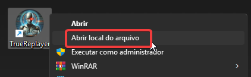
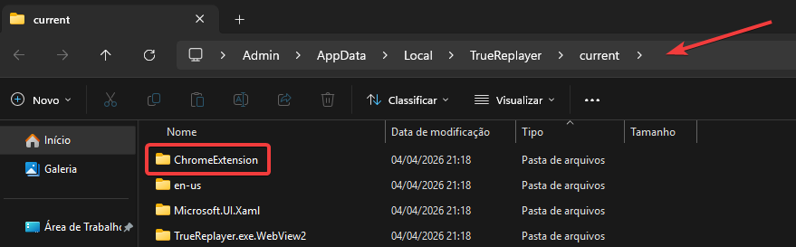
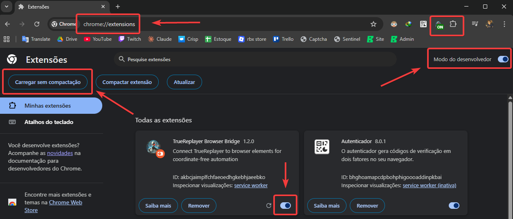
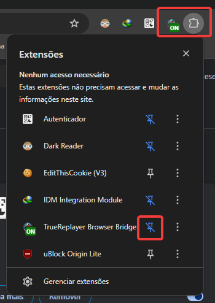

# Chrome Extension Setup

## 1. Open install folder

Right-click the TrueReplayer shortcut and select **Open file location**.

## 2. Find the extension folder

Navigate to the **ChromeExtension** folder inside the TrueReplayer directory.

> Path: `AppData\Local\TrueReplayer\current\ChromeExtension`

## 3. Load in Chrome

1. Open **chrome://extensions** in your browser
2. Enable **Developer mode** (top right toggle)
3. Click **Load unpacked**
4. Select the **ChromeExtension** folder from step 2

## 4. Pin the extension

Click the **Extensions** puzzle icon in Chrome toolbar and **pin** TrueReplayer Browser Bridge. The badge will show **ON** when connected.

---

**Done!** The extension updates automatically with TrueReplayer. When a new version is available, the badge will show **!** — just click **Reload** in chrome://extensions.
